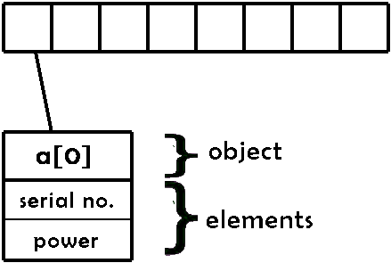

### 文章内容

[C++中的继承](#CPlusPlus中的继承)

[protectd属性在继承中的作用](#protectd属性在继承中的作用)

[有构造函数和析构函数的派生类](#有构造函数和析构函数的派生类)

[构造函数的重载](#构造函数的重载)

[类对象数组声明](#类对象数组声明)

[C++的函数重载和函数重写](#CPlusPlus的函数重载和函数重写)

### CPlusPlus中的继承

创建一个基类和它的派生类，如下:

```C++
#include <iostream>
#include <string>

using namespace std;

class Student //基类
{
private:
	string name;

public:
	Student():name("He"){}
	~Student(){}
	string getName();
	void setName( string n);
	void printAbout();
};

string Student::getName()
{
	return name;
}

void Student::setName(string n)
{
	name = n;
}

void Student::printAbout()
{
	cout << "I am a student"<<endl;
}

class UnderGraduate : public Student //派生类
{
public:
	void printAbout();
};

void UnderGraduate::printAbout()
{
	cout<<"I am a undergraduate"<<endl;
}

int main()
{	Student s;
	UnderGraduate u;
	string name = s.getName();
	cout<<name<<endl;
	s.printAbout();
	u.printAbout();
	return 0;
}
```

`class Undergraduate: public Student` 'Undergraduate'是'Student'类的子类或衍生类的名字。
这两个类都具有相同名称的函数—'printAbout'。但是函数的定义(或语句)是不同的。这些类型的函数称为多态函数。

由“s”(Student类的对象)执行“printAbout”将会打印“我是一名学生”，而由“u”(UnderGraduate类的对象)执行“我是一名本科生”将会打印“我是一名本科生”。

### protectd属性在继承中的作用

类(变量或函数)的任何受保护成员都可以在该类或其子类中访问。在此之外不能访问它。

在上面的代码中将数据成员属性修改为protected

```C++
int main()
{
	UnderGraduate u;
	u.setName("xyz");
	u.printAbout();
	return 0;
}
```

在这个例子中，‘Student’是基类，‘Undergraduate’是它的派生类。

在“Student”类中，我们让name protected。因此，它可以直接在其子类“UnderGraduate”中访问。我们也这么做了。我们直接在函数printName的子类中访问name变量。

派生类的对象可以访问其基类的成员(如果不是私有的)，但是基类的对象不能访问其派生类的成员。

注:C++中子可以啃老，老却不能啃子。C++中的派生类(子类)都是不孝子。

### 有构造函数和析构函数的派生类

通常可以同时使用基类和派生类的构造函数来初始化它们各自的成员。派生类的构造函数可以调用基类的构造函数，但反之则不正确。

#### 3.1调用没有参数的基类构造函数

如果基类构造函数没有参数，那么无论何时调用派生类构造函数，编译器都会自动调用它，即使我们没有显式地调用它。

```C++
#include <iostream>

using namespace std;

class A
{
	public:
		A()
		{
			cout << "Constructor of A" << endl;
		}
};

class B : public A
{
	public:
		B()
		{
			cout << "Constructor of B" << endl;
		}
};

int main()
{
	B b;
	return 0;
}
```
在调用任何类的构造函数时，编译器首先自动调用其基类的构造函数。编译器首先调用基类A的构造函数，然后调用B的构造函数。因此，当调用“B”的构造函数时，编译器首先调用“A”的构造函数，因此先输出“Constructor of A”，然后输出“Constructor of A”。

在调用任何类的构造函数时，编译器首先自动调用其基类的构造函数。

```C++
#include <iostream>

using namespace std;

class A
{
	public:
		A()
		{
			cout << "Constructor of A" << endl;
		}
};

class B : public A
{
	public:
		B()
		{
			cout << "Constructor of B" << endl;
		}
};

class C : public B
{
	public:
		C()
		{
			cout << "Constructor of C" << endl;
		}
};

int main()
{
	cout << "Creating object of A :" << endl;
	A a;
	cout << "Creating object of B :" << endl;
	B b;
	cout << "Creating object of C :" << endl;
	C c;
	return 0;
}
```

这段代码的输出为:
```
Creating object of A :
Constructor of A
Creating object of B :
Constructor of A
Constructor of B
Creating object of C :
Constructor of A
Constructor of B
Constructor of C
```
可以看出A派生B，B派生出C。C继承了A,B的构造函数方法。

#### 3.2调用带参数的基类构造函数

与没有参数的基类构造函数不同，有参数的基类构造函数在调用其派生类构造函数时不会被自动调用。

要调用具有某些参数的父类构造函数作为其子类的构造函数，必须使用其**子类的初始化列表**(也就是C++方式的构造函数初始化方式)。

```C++
#include <iostream>

using namespace std;

class A
{
	public:
		A( int l )
		{
			cout << "Length : " << l << endl;
		}
};

class B : public A
{
	public:
		B() : A(10)
		{
			cout << "This is constructor of B" << endl;
		}
};

int main()
{
	B b;
	return 0;
}
```

创建类B的对象b时，调用构造函数“B()”。由于'A'的构造函数写在它的初始化列表中，所以先调用'A'的构造函数，并将值10作为参数传递。

因此，它的参数l变成了10，并执行了'A'的构造函数体。在那之后，'B'的构造函数体被执行。
```C++
#include <iostream>

using namespace std;

class A
{
	int l1;
	public:

		A( int z ) : l1(z)
		{
			cout << "l1 : " << l1 << endl;
		}
};

class B : public A
{
	int l2;
	public:
		B( int x, int y ) : A(x), l2(y)
		{
			cout << "l2 : " << l2 << endl;
		}
};

int main()
{
	B b( 5, 10 );
	return 0;
}
```
而这段代码，在创建类B的对象时将值5和10传递给类B的构造函数。5和10分别赋值给x和y。在构造函数“B”的初始化列表中，“x”的值即5作为构造函数“A”的参数传递，“l2”的值为10。

同样，'A'的构造函数第一次被调用时将'l1'的值设置为5。在'A'的主体被执行之后，编译器返回到'B'的构造函数主体并执行它。

然后通过前面的矩形类派生一个正方形类如下:

```C++
#include <iostream>

using namespace std;

class Rectangle
{
	int length;
	int breadth;
	public:
		Rectangle( int l, int b ):length(l),breadth(b){}

		int getArea();

		int getPerimeter();

};

int Rectangle::getArea()
{
	return length * breadth;
}

int Rectangle::getPerimeter()
{
	return 2*( length + breadth );
}

class Square : public Rectangle
{
	public:
		Square( int a ) : Rectangle( a, a )
		{ }
};

int main()
{
	Square s(2);
	int area, p;
	area = s.getArea();
	p = s.getPerimeter();
	cout << "Area : " << area << endl;
	cout << "Perimeter : " << p << endl;
	return 0;
}
```

正方形是具有相同长度和宽度的长方形。这就是我们在‘Square’的构造函数中所做的。
我们创建了一个类‘Square’的对象‘s’，并在创建时传递了2。因此，这个2将被传递给类Square的构造函数。因此，a的值是2。

在'Square'的构造函数的初始化列表中，它的基类'Rectangle'的构造函数被调用，其值'a'为2，从而使其长度和宽度的值都等于'a'，即2。

最后，在主函数中，我们使用类Square的对象's'来调用其基类Rectangle的两个函数getArea和getPerimeter。

### 构造函数的重载

有一个'Student'类，在创建它的对象时，假设想要传递它的一个名字，如果没有传递任何东西，那么这个名字应该是"unknown"。通过两个构造函数来实现这一点。

```C++
#include <iostream>
#include <string>

using namespace std;

class Student
{
	string name;
	public:
		Student( string n )
		{
			name = n;
		}
		Student()
		{
			name = "unknown";
		}
		void printName()
		{
			cout << name << endl;
		}
};

int main()
{
	Student a( "xyz" );
	Student b;
	a.printName();
	b.printName();
	return 0;
}
//OUTPUT:
/*
xyz
unknown
*/
```
这称为构造函数重载。其实也就是函数重载的一种。

这个例子做了什么？创建了为'Student'类的两个对象。在创建对象“a”时，我们将字符串“xyz”通过Student a(“xyz”)传递给对象;。这将调用具有字符串参数`Student(string n)`的构造函数。

类似地，在创建Student类的第二个对象'b'时，我们没有将任何内容作为Student b传递给对象'b';。因此，调用了没有参数Student()的构造函数，并使用未知的值初始化名称。

**构造函数重载的条件**

构造函数重载的一个条件是两个构造函数必须有**不同的参数**。就像上面的例子一样，在第一个构造函数中，传递了一个字符串，而在第二个构造函数中，什么也没有传递。

不能让两个构造函数有完全相同的参数(例如，两个构造函数都有两个int)。

参数的数量或类型必须是不相同的。

可以有任意数量的构造函数，但是参数不同。

### 类对象数组声明

假若有一个矩形对象，如果必须打印两个具有不同维度的矩形的面积，我们可以创建Rectangle类的两个对象，每个对象表示一个矩形。

```C++
#include <iostream>

using namespace std;

class Rectangle
{
	public:
		int length;
		int breadth;
		Rectangle( int l, int b ):length(l),breadth(b){}

		int printArea();
};

int Rectangle::printArea()
{
	return length * breadth;
}

int main()
{
	Rectangle rt1( 7, 4 );
	Rectangle rt2( 4, 5 );
	cout << "Area of first rectangle " << rt1.printArea() << endl;
	cout << "Area of second rectangle " << rt2.printArea() << endl;
	return 0;
}
//OUTPUT:
/*
Area of first rectangle 28
Area of second rectangle 20
*/
```
这段代码里创建了两个实例rt1和rt2
Rectangle rt1(7,4);-创建对象“rt1”，并将其length和breadth分别赋值为7和4。rt2同理。

那么如果我们要50个矩阵实例时又该怎么办呢，只有用数组来实现。
```C++
#include <iostream>
#include <string>

using namespace std;

class Student
{
	string name;
	int marks;
	public:
		void getName();

		void getMarks();

		void displayInfo();

};

void Student::getName()
{
	getline( cin, name);
}

void Student::getMarks()
{
	cin >> marks;
}

void Student::displayInfo()
{
	cout << "Name : " << name << endl;
	cout << "Marks : " << marks << endl;
}

int main()
{
	Student st[5];//创建了5个Student实例
	for( int i=0; i<5; i++ )
	{
		cout << "Student " << i + 1 << endl;
		cout << "Enter name" << endl;
		st[i].getName();
		cout << "Enter marks" << endl;
		st[i].getMarks();
	}

	for( int i=0; i<5; i++ )
	{
		cout << "Student " << i + 1 << endl;
		st[i].displayInfo();
	}
	return 0;
}
//OUTPUT:
/*
Student 1
Enter name
Jack
Enter marks
54
Student 2
Enter name
Marx
Enter marks
45
Student 3
Enter name
Julie
Enter marks
47
Student 4
Enter name
Peter
Enter marks
23
Student 5
Enter name
Donald
Enter marks
87
Student 1
Name : Jack
Marks : 54
Student 2
Name : Marx
Marks : 45
Student 3
Name : Julie
Marks : 47
Student 4
Name : Peter
Marks : 23
Student 5
Name : Donald
Marks : 87
*/
```

Student[5];-创建了一个学生类的5个对象的数组，其中每个对象代表一个学生有一个名字和分数。

第一个for循环用于获取学生的姓名和分数的输入。getName()和getMarks()函数分别接受name和marks的输入。
第二个for循环是打印所有5名学生的名字和分数。为此，我们为每个学生调用displayInfo()函数。



### CPlusPlus函数重载和函数重写

#### 7.1函数重载

函数重载条件:

1. 要重载的函数必须具有相同的名称。
2. 所有函数必须有不同的参数(不同数量的参数或不同类型的参数)。

```C++
#include <iostream>

using namespace std;

class Rectangle
{
	public:
		void printArea(int x, int y);
		void printArea(int x);
		void printArea(int x, double y);
		void printArea(double x);

};

void Rectangle::printArea(int x, int y)
{
	cout << x * y << endl;
}

void Rectangle::printArea(int x)
{
	cout << x << endl;

}

void Rectangle::printArea(int x, double y)
{
	cout << x * y << endl;
}

void Rectangle::printArea(double x)
{
	cout << x << endl;
}

int main()
{
	Rectangle rt;
	rt.printArea(2,4);
	rt.printArea(2,5.1);
	rt.printArea(10);
	rt.printArea(2.3);
	return 0;
}
```

定义了四个具有相同名称“printArea”但不同参数的函数。
主函数中四个printArea方法分别调用四种不同的函数，完成了重载。
```C
//输出为
8
10.2
100
5.29
```

#### 7.2函数重写

函数重写也称为多态性。函数重写可以理解为方法覆盖，写一个例子。
```C++
#include <iostream>

using namespace std;

class Animals
{
	public:
		void sound();
};
void Animals::sound()
{
	cout << "This is parent class" << endl;
}

class Dogs : public Animals
{
	public:
		void sound();
};

void Dogs::sound()
{
	cout<< "Dogs bark" << endl;
}

int main()
{
	Dogs d;
	d.sound();
	return 0;
}
//输出为
//Dogs bark
```
'Dogs'和它的基类'Animals'具有相同的函数void sound()。当Dogs类的对象'd'调用这个函数时，将调用派生类'Dogs'的函数，而不是基类的函数。因此，当被派生类的对象调用时，派生类的函数会覆盖基类中的函数。

函数覆盖的条件

- 基类和派生类的函数必须具有相同的名称。
- 函数必须具有相同的参数列表和返回类型。
- 声明为静态的函数不能被覆盖。
- 如果一个函数不能被继承，那么它就不能被覆盖。
- 构造函数不能被覆盖

```C++
#include <iostream>

using namespace std;

class Animals
{
	public:
		void sound()
		{
			cout << "This is parent class" << endl;
		}
};

class Dogs : public Animals
{
	public:
		void sound()
		{
			cout << "Dogs bark" << endl;
		}
};

class Cats : public Animals
{
	public:
		void sound()
		{
			cout << "Cats meow" << endl;
		}
};

class Pigs : public Animals
{
	public:
		void sound()
		{
			cout << "Pigs snort" << endl;
		}
};

int main()
{
	Dogs d;
	Cats c;
	Pigs p;
	d.sound();
	c.sound();
	p.sound();
	return 0;
}
//输出为
//Dogs bark
//Cats meow
//Pigs snort
```