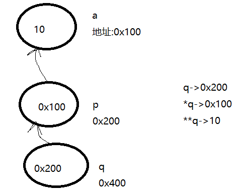

## 右值引用

搞明白右值引用要先弄明白C++中的引用是什么？应用可以理解为别名。

那么接下来看看以下问题?

**C++的引用   引用和指针的区别？**
1. 左值引用和右值引用
2. 引用的实例

**引用是一种更安全的指针。**
1. 引用是必须初始化的，指针可以不初始化
2. 引用只有一级引用，没有多级引用；指针可以有一级指针，也可以有多级指针
3. 定义一个引用变量，和定义一个指针变量，其汇编指令是一模一样的；通过引用

变量修改所引用内存的值，和通过指针解引用修改指针指向的内存的值，其底层指令也是一模一样的

**右值引用**
1. int &&c = 20; 专门用来引用右值类型，指令上，可以自动产生临时量然后直接引用临时量 c = 40;
2. 右值引用变量本身是一个左值，只能用左值引用来引用它
3. 不能用一个右值引用变量，来引用一个左值

这里解释一下右值引用变量本身是一个左值，只能用左值引用来引用它。一个`&`是左值引用,`&&`是右值引用

```C++
int &&c = 20; /// c这个变量是左值
```

下面看一段代码:


```C++
#include <iostream>
#include <typeinfo>
using namespace std;
int main()
{
	int a = 10; // 左值，它有内存，有名字，值可以修改的
	int &b = a;

	//int &c = 20; // 20是右值：没内存，没名字。 这句是错的左值不能引用右值
	//C++11提供了右值引用,汇编中是先mov再lea和左值引用相反,然后多了一步mov
	int &&c = 20; // 右值引用引用右值
	c = 30;

	int &e = c; // 一个右值引用变量，本身是一个左值

	/*
	int temp = 20;
	temp -> d
	*/
	const int &d = 20; //可编译通过,汇编中和右值引用一样
	// 与右值引用不同的是d无法修改
	return 0;
}
```

## 一图理解指针

```C++
int a = 20;
int *p = &a;
int **q = &p;

// 如何修改a的值呢
*p = 30; // 直接修改a的值
**q = 40;// 直接修改a的值
*q = &b;// 修改指向的变量,这改不了a的值
```

下面看一张图

