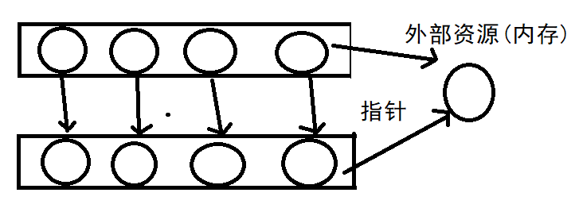

## 类对象的细节和原理

### this指针

直接看代码

CGoods可以定义无数的对象，每一个对象都有自己的成员变量
但是它们共享一套成员方法
show() => 怎么知道处理哪个对象的信息？
init(name, price, amount) => 怎么知道把信息初始化给哪一个对象的呢？

类的成员方法一经编译，所有的方法参数，都会加一个this指针，接收调用该方法的对象的地址
在下面代码中比如`void setName(char *name)`实际上是`void setName(CGoods *this, char *name)`。请注意构造函数列表初始化也省略了this
```C++
void setPrice(double price) { _price = price; }
// 实际上是
void setPrice(CGoods *this, double price)
{
	this->_price = price;
}
```

```C++
#include <iostream>
#include <cstring>

using namespace std; // std::cout std::endl

/*
C++ OOP面向对象   OOP编程，this指针
C： 各种各样的函数的定义  struct
C++：类   =>  实体的抽象类型
实体（属性、行为） ->  ADT(abstract data type)
 |                            |
对象			  <-(实例化) 类（属性->成员变量  行为->成员方法）
OOP语言的四大特征是什么？
抽象    封装/隐藏    继承    多态
类 -> 商品实体
访问限定符：public公有的 private私有的 protected保护的
*/
const int NAME_LEN = 20;
class CGoods  // => 商品的抽象数据类型
{
public: // 给外部提供公有的成员方法，来访问私有的属性
	// 做商品数据初始化用的  
	void init(const char *name, double price, int amount);
	// 打印商品信息
	void show();
	// 给成员变量提供一个getXXX或setXXX的方法 类体内实现的方法，自动处理成inline内联函数
	void setName(char *name) { strcpy(_name, name); }
	void setPrice(double price) { _price = price; }
	void setAmount(int amount) { _amount = amount; }

	const char* getName() { return _name; } // 如果返回普通char*则外部可以拿到私有成员变量的值
	double getPrice() { return _price; }
	int getAmount() { return _amount; }
private: // 属性一般都是私有的成员变量
	char _name[NAME_LEN]; //  20字节 对齐=>24
	double _price;  // 8字节 谁类型最长按照谁对齐
	int _amount; // 4字节 对齐=> 8字节
};
void CGoods::init(const char *name, double price, int amount)
{
	strcpy(this->_name, name); // 实际上不加this也可以,编译器会自动添加
	this->_price = price;
	this->_amount = amount;
}
void CGoods::show()
{
	cout << "name:" << this->_name << endl;
	cout << "price:" << this->_price << endl;
	cout << "amount:" << this->_amount << endl;
}
int main()
{
	/*
	CGoods可以定义无数的对象，每一个对象都有自己的成员变量
	但是它们共享一套成员方法
	show() => 怎么知道处理哪个对象的信息？
	init(name, price, amount) => 怎么知道把信息初始化给哪一个对象的呢？
	
	类的成员方法一经编译，所有的方法参数，都会加一个this指针，接收
	调用该方法的对象的地址
    在上述代码中比如void setName(char *name)实际上是void setName(CGoods *this, char *name)
	*/
	
	// 对象内存大小的时候  对象的内存大小 => 只和成员变量有关
	CGoods good1; // 类实例化了一个对象
    // 实际调用还传入了good1
	// init(&good1, "面包", 10.0, 200) 
	good1.init("面包", 10.0, 200);
	// show(&good1)
	good1.show();

	good1.setPrice(20.5); // 改变面包的单价
	good1.setAmount(100); // 改变面包库存
	good1.show();

	CGoods good2;// 类实例化了一个对象
	good2.init("空调", 10000.0, 50);
	good2.show();

    return 0; 
}
```

### 析构和构造使用的原理

下面来实现一个顺序栈:

注意两点:构造函数可以有多个,析构函数只能有一个。
```C++
#include <iostream>
using namespace std;

/*
OOP实现一个顺序栈 
构造函数和析构函数
函数的名字和类名一样
没有返回值
*/
class SeqStack
{
public:
	// 构造函数 SeqStack s1;  SeqStack s2(20);
	SeqStack(int size = 10) // 是可以带参数的，因此可以提供多个构造函数，叫做构造函数的重载
	{
		cout << this << " SeqStack()" << endl; // this这里指向对象的内存
		_pstack = new int[size];
		_top = -1;
		_size = size;
	}
	// 析构函数
	~SeqStack() // 是不带参数的，所有析构函数只能有一个
	{
		cout << this << " ~SeqStack()" << endl; // this这里指向地址
		delete []_pstack;
		_pstack = nullptr;
	}
	void push(int val) // 入栈
	{
		if (full()) // 栈满扩容
			resize();
		_pstack[++_top] = val; 
	}
	void pop() // 出栈
	{
		if (empty())
			return;
		--_top;
	}
	int top()
	{
		return _pstack[_top];
	}
	bool empty() { return _top == -1; } // 判断是否为空
	bool full() { return _top == _size - 1; } // 判断是否为满
private:
	int *_pstack; // 动态开辟数组，存储顺序栈的元素
	int _top; // 指向栈顶元素的位置
	int _size; // 数组扩容的总大小

	void resize() // 私有方法,只给public方法调用的
	{
		int *ptmp = new int[_size * 2]; // 扩容两倍
		for (int i = 0; i < _size; ++i)
		{
			ptmp[i] = _pstack[i]; // 原来内存的数据拷贝到新的里
		}
        // 为什么不用以下的函数? 下面涉及的是内存拷贝,在对象里不适合。(深拷贝浅拷贝中的问题) 
        // memcpy(ptmp, _pstack, sizeof(int)*_size); realloc
		delete[]_pstack; // 释放掉原来的内存
		_pstack = ptmp;
		_size *= 2;
	}
};
SeqStack gs; // 全局变量程序结束时才析构
int main() // 先构造的后析构,后构造的先析构 是栈
{

	//  1.开辟内存  2.调用构造函数 
	SeqStack s;
	//s.init(5);  // 对象成员变量的初始化操作

	for (int i = 0; i < 15; ++i)
	{
		s.push(rand() % 100);
	}

	while (!s.empty())
	{
		cout << s.top() << " ";
		s.pop();
	}

	//s.release(); // 释放对象成员变量占用的外部堆内存（外部资源）

	SeqStack s1(50);

	//s1.~SeqStack(); // 析构函数调用以后，我们说对象不存在了,不建议自己掉
    // 析构以后再调用方法的话,堆内存的非法访问了！！！
	s1.push(30); 

    /*
	.data 
	heap
	stack
	*/
	SeqStack *ps = new SeqStack(60); // malloc内存开辟+SeqStack(60)对象构造
	ps->push(70);
	ps->push(80);
	ps->pop();
	cout << ps->top() << endl;
	// 堆上一定得手动释放
    delete ps; //先调用ps->~SeqStack()+然后free(ps) <- delete做了这两个操作   
    // delete和free的区别


	return 0; // 栈上对象在return处析构,调用析构函数
}
```

注意注释中代码的析构顺序。下面看如下代码:

```C++
SeqStack *ps = new SeqStack(60); // malloc内存开辟+SeqStack(60)对象构造
ps->push(70);
ps->push(80);
ps->pop();
cout << ps->top() << endl;
delete ps;
```
delete ps; 做了两件事情调用`ps->~SeqStack()`+然后`free(ps)`。free和delete的区别就存在delete是更加智能的能够先析构再释放而free不行。

### 深浅拷贝

什么是浅拷贝？以及如何解决该问题?

拷贝可以理解为一个对象把值赋给另一个。

1. 首先要明白对象默认的拷贝构造函数是只做内存数据的拷贝。

那么如下图。



每一个圆代表一个对象,长方体代表内存,看前三个对象(圆)是不可能发生内存泄漏的。因为对象析构资源自动返回内存中,那么第四个对象就危险了。

2. 对象占用了外部资源,那么拷贝构造就仅仅是把外部内存的地址给了被拷贝者。这样任意一个析构,外部资源被析构了,就会有一个对象指向了被释放的内存造成内存泄漏。这就是浅拷贝现象

解决方案也很简单,以SeqStack为例。

```C++
class SeqStack
{
public:
	// 省略
private:
	int *_pstack;
	int _top;
	int _size;
}
```

`int *_pstack;`
```C++
int main()
{
	SeqStack s1(10);
	SeqStack s2 = s1; // 必会发生浅拷贝,s2和s1共用*_pstack指针。
	SeqStack s3(s1); // 必会发生浅拷贝,s3和s1同上
}
```
如何解决浅拷贝,赋值和拷贝构造时重新分配新内存就行了。

那么还记得说的吗？C++的类理应有构造函数,析构函数,拷贝构造函数,赋值构造函数,以及后续会讲到的move构造函数这5大函数。拷贝构造函数,赋值构造函数就是解决了浅拷贝问题。

SeqStack中新增拷贝构造函数,赋值构造函数
```c++
class SeqStack
{
public:
	// 省略
	// 拷贝构造函数
	SeqStack(const SeqStack &src)
	{
		cout << "SeqStack(const SeqStack &src)" << endl;
		_pstack = new int[src._size];
		for (int i = 0; i <= src._top; ++i)
		{
			_pstack[i] = src._pstack[i];
		}
		_top = src._top;
		_size = src._size;
	}
	// 赋值构造函数
	void operator=(const SeqStack &src)
	{
		cout << "operator=" << endl;
		// 防止自赋值
		if (this == &src)
			return;

		// 需要先释放当前对象占用的外部资源
		delete[]_pstack;
        // 重新开辟引用的外部资源的空间
		_pstack = new int[src._size];
		for (int i = 0; i <= src._top; ++i)
		{
			_pstack[i] = src._pstack[i];
		}
		_top = src._top;
		_size = src._size;
	}
private:
	int *_pstack;
	int _top;
	int _size;
}
```

[完整源文件](https://github.com/helintongh/CplusplusQuickGuide/blob/master/src/02%E7%B1%BB%E5%92%8C%E5%AF%B9%E8%B1%A1%E7%9A%84%E7%BB%86%E8%8A%82%E4%B8%8E%E5%8E%9F%E7%90%86/03%E6%B7%B1%E6%8B%B7%E8%B4%9D%E5%92%8C%E6%B5%85%E6%8B%B7%E8%B4%9D.cpp)

[实现一个基础String](https://github.com/helintongh/CplusplusQuickGuide/blob/master/src/02%E7%B1%BB%E5%92%8C%E5%AF%B9%E8%B1%A1%E7%9A%84%E7%BB%86%E8%8A%82%E4%B8%8E%E5%8E%9F%E7%90%86/04_1%E7%B1%BB%E5%92%8C%E5%AF%B9%E8%B1%A1%E4%BB%A3%E7%A0%81%E5%AE%9E%E8%B7%B5.cpp)

[实现一个循环队列](https://github.com/helintongh/CplusplusQuickGuide/blob/master/src/02%E7%B1%BB%E5%92%8C%E5%AF%B9%E8%B1%A1%E7%9A%84%E7%BB%86%E8%8A%82%E4%B8%8E%E5%8E%9F%E7%90%86/04_2%E7%B1%BB%E5%92%8C%E5%AF%B9%E8%B1%A1%E4%BB%A3%E7%A0%81%E5%AE%9E%E8%B7%B5_%E5%AE%9E%E7%8E%B0%E4%B8%80%E4%B8%AA%E5%BE%AA%E7%8E%AF%E9%98%9F%E5%88%97.cpp)

### 构造列表初始化

提供了带参数的构造,就不会自动生成默认构造了

```C++
  
#include <iostream>
#include <cstring>
using namespace std;


/*
构造函数的初始化列表 ： 可以指定当前对象成员变量的初始化方式
CDate信息 是  CGoods商品信息的一部分  a part of...  组合的关系
*/

class CData; // 日期类

class CGoods
{
public:
	// “CDate”: 没有合适的默认构造函数可用,只能用自定义的
	CGoods(const char *n, int a, double p, int y, int m, int d) // 提供了带参数的构造,就不会自动生成默认构造了
		:_date(y, m, d) // CData _data(y, m, d); // 指定了日期对象的构造方式
		,_amount(a) // int _amount = a;
		,_price(p) // #1 构造函数的初始化列表
	{
		// #2 当前类类型构造函数体
		strcpy(_name, n);
        // _amount = a; // 相当于 int _amount; _amount = a; 有两步
        // _data = CData(y, m, d); // 出错,CData _data;没有默认构造这一步出错
    }
	void show()
	{
		cout << "name:" << _name << endl;
		cout << "amount:" << _amount << endl;
		cout << "price:" << _price << endl;
		_date.show();
	}
private:
	char _name[20];
	int _amount;
	double _price;
	CDate _date;  // 成员对象  1.分配内存  2.调用构造函数 => 达成了CData和CGoods的组合
};

/*
日期类
*/
class CDate
{
public:
	CDate(int y, int m, int d) // 自定义了一个构造函数，编译器就不会再产生默认构造了
	{
		_year = y;
		_month = m;
		_day = d;
	}
	void show()
	{
		cout << _year << "/" << _month << "/" << _day << endl;
	}
private:
	int _year;
	int _month;
	int _day;
};

int main()
{
    CGoods good("商品", 100, 35.0, 2019, 5, 12);
    good.show();

    return 0;
}
```

### 类的各种成员方法

类的各种成员 - 成员方法/变量
普通的成员方法 => 编译器会添加一个this形参变量
1. 属于类的作用域
2. 调用该方法时，需要依赖一个对象(常对象是无法调用的 实参:const CGoods*   CGoods *this)
3. 可以任意访问对象的私有成员   protected继承  public private

static静态成员方法 => 不会生成this形参
1. 属于类的作用域
2. 用类名作用域来调用方法
3. 可以任意访问对象的私有成员，仅限于不依赖对象的成员（只能调用其它的static静态成员）

const常成员方法 => `const CGoods *this`
1. 属于类的作用域
2. 调用依赖一个对象，普通对象或者常对象都可以
3. 可以任意访问对象的私有成员，但是只能读，而不能写

静态成员在.bss段中。换句话说static声明的变量不属于该对象,而是理解为独立的另一个类。于此同时static成员对象的大小不纳入对象内存中。

[源文件](https://github.com/helintongh/CplusplusQuickGuide/blob/master/src/02%E7%B1%BB%E5%92%8C%E5%AF%B9%E8%B1%A1%E7%9A%84%E7%BB%86%E8%8A%82%E4%B8%8E%E5%8E%9F%E7%90%86/06%E6%8E%8C%E6%8F%A1%E7%B1%BB%E7%9A%84%E5%90%84%E7%A7%8D%E6%96%B9%E6%B3%95%E4%BB%A5%E5%8F%8A%E5%8C%BA%E5%88%AB.cpp)

### 指向类成员的指针

```C++
#include <iostream>
using namespace std;

/*
指向类成员(成员变量和成员方法)的指针
*/
class Test
{
public:
	void func() { cout << "call Test::func" << endl; }
	static void static_func() { cout << "Test::static_func" << endl; }

	int ma; // 普通成员变量
	static int mb; // 静态成员变量
};
int Test::mb;
int main()
{

    // 1. 指向成员变量的指针

    // int a = 10; int *p = &a; *p = 30;
    //无法从“int Test::* ”转换为“int *”
    // int *p = &Test::ma; // 不知道说的是哪一个对象的ma
    // int Test::*p = &Test::ma; //也出错
    // *p = 20; // 出错

    Test t1;
    Test *t2 = new Test();

    int Test::*p = &Test::ma;
    t1.*p = 20; // 指明对象才能修改
    cout << t1.*p << endl;

    t2->*p = 30;
    cout << t2->*p << endl;

    int *p1 = &Test::mb; //mb是静态成员变量
    *p1 = 40;
    cout << *p1 << endl;

    // 2. 指向成员方法的指针

    // 无法从“void (__thiscall Test::* )(void)”转换为“void (__cdecl *)(void)”
    // void (*pfunc) () = &Test::func; 出错

    void (Test::*pfunc) () = &Test::func;
    (t1.*pfunc) ();
    (t2->*pfunc) ();

    // 如何定义函数指针指向类的static成员方法呢？
    void (*spfunc) () = &Test::static_func;
    (*spfunc) ();
    

    delete t2;
    return 0;
}
```