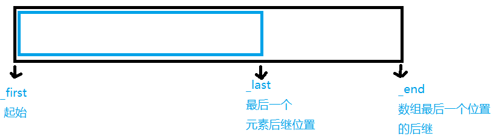

## 模板知识以及实战

模板最基础的教程在 [模板基础](../07.md)

先要明确几个基本概念:

- 函数模板 <= 是不进行编译的，因为类型还不知道
- 模板的实例化 <= 函数调用点进行实例化,真正的类型检查是在实例化的时候才能做。类模板和函数模板编译器看到其定义的时候只能做最基础的语法检查。
- 模板的函数 <= 才是要被编译器所编译的

- 模板类型参数 typename/class 可定义多个参数
- 模板非类型参数

- 模板的实参推演 => 可以根据用户传入的实参的类型，来推导出模板类型参数的具体类型

- 模板的特例化(专用化) 特殊（不是编译器提供的，而是用户提供的）的实例化

函数模板、模板的特例化、非模板函数的重载关系

注:
**模板代码是不能在一个文件中定义，在另外一个文件中使用的**

模板代码调用之前，一定要看到模板定义的地方，这样的话，模板才能够进行正常的实例化，产生能够被编译器编译的代码

所以，模板代码都是放在头文件当中的，然后在源文件当中直接使用

### 特例化模板

假设我们要实现compare函数模板,那么会出现什么问题呢?如何通过普通模板比较字符串的大小呢?所以由此诞生了完全特例化这一种模板情况。

```C++
template<typename T>
bool compare(T a, T b)
{
	cout << "template compare" << endl;
	return a > b; // 如果是这个模板那么compare("aaa", "bbb")是比较字符串地址不符合=>需要特例化一个模板函数
}
// 完全特例化的compare模板函数
template<>
bool compare<const char*>(const char*a, const char*b)
{
	cout << "compare<const char*>" << endl;
	return strcmp(a, b) > 0;
}
```

那么完全特例化又有什么问题呢?写死了,非常的不灵活智能处理`char*`的字符串。这样如果比较类,用户能声明无数个类,每种都给它写一个compare完全特例化,那不可能。所以又诞生了模板部分特例化。

这两者的源代码我还再function函数对象中进行了二次阐述。 [完全特例化](https://github.com/helintongh/CplusplusQuickGuide/blob/master/src/10bind%E7%BB%91%E5%AE%9A%E5%99%A8%E5%92%8Cfunction%E5%87%BD%E6%95%B0%E5%AF%B9%E8%B1%A1/02_3_1%E6%A8%A1%E6%9D%BF%E7%9A%84%E5%AE%8C%E5%85%A8%E7%89%B9%E4%BE%8B%E5%8C%96%E5%92%8C%E9%83%A8%E5%88%86%E7%89%B9%E4%BE%8B%E5%8C%96%E5%A4%8D%E4%B9%A0%E4%BB%80%E4%B9%88%E6%98%AF%E7%89%B9%E4%BE%8B%E5%8C%96.cpp) [部分特例化](https://github.com/helintongh/CplusplusQuickGuide/blob/master/src/10bind%E7%BB%91%E5%AE%9A%E5%99%A8%E5%92%8Cfunction%E5%87%BD%E6%95%B0%E5%AF%B9%E8%B1%A1/02_3_2%E6%A8%A1%E6%9D%BF%E7%9A%84%E5%AE%8C%E5%85%A8%E7%89%B9%E4%BE%8B%E5%8C%96%E5%92%8C%E9%83%A8%E5%88%86%E7%89%B9%E4%BE%8B%E5%8C%96%E4%B9%8B%E7%89%B9%E4%BE%8B%E5%8C%96%E5%BA%94%E7%94%A8.cpp)

直接进入部分特例化源代码就能搞清楚了,找出共性比如不针对字符串而是针对所有指针或者函数指针来特例化就是部分特例化。

```C++
template<typename T>
class Vector 
{
public:
	Vector() { cout << "call Vector template init" << endl; }
};
// 下面这个是对char*类型提供的完全特例化版本  #1
template<>
class Vector<char*>
{
public:
	Vector() { cout << "call Vector<char*> init" << endl; }
};
// 下面这个是对指针类型提供的部分特例化版本  #2
template<typename Ty>
class Vector<Ty*>
{
public:
	Vector() { cout << "call Vector<Ty*> init" << endl; }
};

// 指针函数指针（有返回值，有两个形参变量）提供的部分特例化
template<typename R, typename A1, typename A2>
class Vector<R(*)(A1, A2)>
{
public:
	Vector() { cout << "call Vector<R(*)(A1, A2)> init" << endl; }
};
```

另外还有实参推演可参考该文，我都写好了。 [模板实参推演](https://github.com/helintongh/CplusplusQuickGuide/blob/master/src/10bind%E7%BB%91%E5%AE%9A%E5%99%A8%E5%92%8Cfunction%E5%87%BD%E6%95%B0%E5%AF%B9%E8%B1%A1/02_3_3%E6%A8%A1%E6%9D%BF%E7%9A%84%E5%AE%9E%E5%8F%82%E6%8E%A8%E6%BC%94.cpp) 

### 实战实现一个Vector

首先来看vector有几个功能,push_back,pop_back,以及四大必须函数(除去了move 构造函数),vector还有一个重要功能它是动态扩容的数组,因此当底层数组满的时候需要能够动态增加数组的容量。

vector底层如下图:



```C++
template<typename T>
class vector
{
public:


private:
	T *_first; // 指向数组起始的位置
	T *_last;  // 指向数组中有效元素的后继位置
	T *_end;   // 指向数组空间的后继位置
	void expand() // 容器的二倍扩容
	{
		int size = _end - _first;
		T *ptmp = new T[2 * size];
		for (int i = 0; i < size; ++i)
		{
			ptmp[i] = _first[i];
		}
		delete[]_first;
		_first = ptmp;
		_last = _first + size;
		_end = _first + 2 * size;
	}
};
```

然后是vector必须有的4大函数(拷贝构造,赋值构造,构造,析构)

```C++
class vector
{
public:
	vector(int size = 10)
	{
		// 需要把内存开辟和对象构造分开处理 => 为什么
		_first = new T[size];
		_last = _first;
		_end = _first + size;
	}
	~vector()
	{
		// 析构容器有效的元素，然后释放_first指针指向的堆内存
		delete[]_first;
		_first = _last = _end = nullptr;
	}
	vector(const vector<T> &rhs) // 拷贝构造函数
	{
		int size = rhs._end - rhs._first;
		_first = new T[size];
		int len = rhs._last - rhs._first;
		for (int i = 0; i < len; ++i)
		{
			_first[i] = rhs._first[i];
		}
		_last = _first + len;
		_end = _first + size;
	}
	vector<T>& operator=(const vector<T> &rhs) // 赋值构造函数
	{
		if (this == &rhs) // 排除自赋值
			return *this;

		delete[]_first;

		int size = rhs._end - rhs._first;
		_first = new T[size];
		int len = rhs._last - rhs._first;
		for (int i = 0; i < len; ++i)
		{
			_first[i] = rhs._first[i];
		}
		_last = _first + len; // 最后一个元素的后继
		_end = _first + size; // 数组最后一个位置的后继
		return *this;
	}
	// 省略
}
```

然后实现`push_back`,`pop_back`等函数

```C++
void push_back(const T &val) // 向容器末尾添加元素
{
	if (full())
		expand();
	*_last++ = val;   //_last指针指向的内存构造一个值为val的对象
}
void pop_back() // 从容器末尾删除元素
{
	if (empty())
		return;
	--_last; // 不仅要把_last指针--，还需要析构删除的元素
}
T back()const // 返回容器末尾的元素的值
{
	return *(_last - 1);
}
bool full()const { return _last == _end; } // 判断是否满
bool empty()const { return _first == _last; } // 判断是否空
int size()const { return _last - _first; } // 得到元素的大小
```

完整代码在 

如果你运行完整代码你会发现运行的很好。但是存在一个很大的问题。

让我们来看第二份代码 [点此](https://github.com/helintongh/CplusplusQuickGuide/blob/master/src/03%E6%A8%A1%E6%9D%BF%E7%BC%96%E7%A8%8B/02_2%E5%88%9D%E5%A7%8Bvector2.cpp)

```C++
// 定义一个Test类
class Test
{
public:
	Test() { cout << "Test()" << endl; }
	~Test() { cout << "~Test()" << endl; }
	Test(const Test&) { cout << "Test(const Test&)" << endl; }
};

int main()
{

	Test t1, t2, t3;
	cout << "-------------------" << endl;
	vector<Test> vec; // 如果没有空间配置器的话,上一章实现的初始vector会直接调用10次Test构造函数,构造了10个对象,销毁会析构10次
	vec.push_back(t1); // 初始vector用了new,每一个都放了Test对象,push_back就相当于赋值。容器生成时应该只有对象调用拷贝构造
	vec.push_back(t2);
	vec.push_back(t3);
	cout << "-------------------" << endl;
	vec.pop_back(); // 只需要析构对象。 要把对象的析构和内存释放分离开  delete却做了析构和内存释放
	cout << "-------------------" << endl;

	return 0;
}
```
这一份代码我们新设计一个类Test,然后用自己实现的vector来存放这个Test类,注意看代码输出。我们仅仅push_back了三个Test类,弹出了一个Test类,但是缺执行了10次析构函数。这开销非常巨大,这样写出来的代码效率低的可怕。

首先看上一份代码的问题:

```C++
void pop_back() // 从容器末尾删除元素
{
	if (empty())
		return;
	--_last; // 不仅要把_last指针--，还需要析构删除的元素
}
```

pop_back占用外部资源的情况,指针--不行。直接_last指针--会造成指针不存在的情况。要析构它,需要使用delete,不仅析构还释放数组堆的内存。

为什么需要空间适配器?

核心: `new`和`delete`来构造容器会有错误。

```C++
Test t1, t2, t3;
cout << "-------------------" << endl;
vector<Test> vec;
vec.push_back(t1);
```
vec.push_back(t1);没有空间适配器allocator的话相当于用new赋值,实际上当vector底层空间没有满的时候,push_back直接拷贝构造就可以了这样省去了开辟内存的操作。

为什么需要allocator已经很明显了

1. 内存开辟和对象析构分开。

2. 只析构有效的对象,然后才释放。

[源文件](https://github.com/helintongh/CplusplusQuickGuide/blob/master/src/03%E6%A8%A1%E6%9D%BF%E7%BC%96%E7%A8%8B/02_3%E5%AE%9E%E7%8E%B0vector.cpp)

先看空间适配器

```C++
// 容器的空间配置器allocator 做四件事情 内存开辟/内存释放   对象构造/对象析构
template<typename T>
struct Allocator
{
	T* allocate(size_t size)
	{
		return (T*)malloc(sizeof(T) * size);
	}
	void deallocate(void *p)
	{
		free(p);
	}
	void construct(T *p, const T &val) // 负责对象构造
	{
		new (p) T(val); // 定位new,在指定的内存上构造一个值为val的对象
	}
	void destroy(T *p) // 负责对象析构
	{
		p->~T(); // ~T()代表了T类型的析构函数
	}
};
```

怎么使用空间适配器呢,如下:
模板可以泛化变量,指针,函数以及对象。先来看私有成员变量,多了一个

```C++
template<typename T, typename Alloc = Allocator<T>> 
class vector
{
public:
// 省略
private:
	T *_first; // 指向数组起始的位置
	T *_last;  // 指向数组中有效元素的后继位置
	T *_end;   // 指向数组空间的后继位置
	Alloc _allocator; // 定义容器的空间配置器对象
	// 然后改造扩容函数
	void expand()
	{
		int size = _end - _first;
		//T *ptmp = new T[2 * size]; 没有空间适配器时
		T *ptmp = _allocator.allocate(2*size);
		for(int i = 0; i < size; ++i)
		{
			//ptmp[i] = _first[i];
			allocate.construct(ptmp+i, _first[i]);
		}
		//delete[]_first;
		for(T *p = _first; p != _last; ++p)
		{
			_allocator.destroy(p);
		}
		_allocator.deallocate(_first);
		_first = ptmp;
		_last = _first + size;
		_end = _first + 2 * size;
	}
};
```

从一个扩容函数可知我们把内存的开辟释放和构造析构函数的执行分开了,更多的请参考源代码文件。