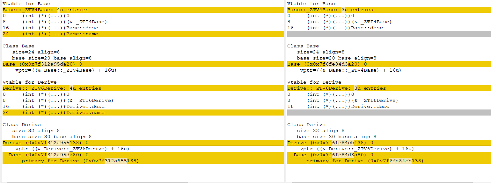

## 继承与多态

要想记住一个东西,最需要弄明白的是Why为什么需要它。要想学好继承与多态就要搞明白(或者说是理解这些解决了什么)

[一.继承的本质和原理](#继承的本质和原理)

[二.派生类的构造过程](#派生类的构造过程)

[三.重载、覆盖、隐藏](#重载与隐藏)

[四.静态绑定和动态绑定](#虚函数-静态绑定-动态绑定)

[五.虚表细节补充](#虚表细节补充)

### 继承的本质和原理

1. 继承的本质和原理
继承的本质：a.代码的复用  
b.类和类之间的存在关系：
组合：a part of... ...一部分的关系
继承：a kind of... ...一种的关系
注: 自己的成员变量自己是可以访问的(无论什么属性)，成员方法的访问限定也与下面相同

2. 访问权限

总结：
1)外部只能访问对象public的成员，protected和private的成员无法直接访问
2)在继承结构中，派生类从基类可以继承过来private的成员，但是派生类却无法直接访问
3)protected和private的区别？在基类中定义的成员，想被派生类访问，但是不想被外部访问，那么在基类中，把相关成员定义成protected保护的；如果派生类和外部都不打算访问，那么在基类中，就把相关成员定义成private私有的。

继承的图解

```c++
class A
{
public:
    int ma;
protected:
    int mb;
private:
    int mc; // 自己或者友元能访问私有的成员
};
//继承 A 基类/父类   B 派生类/子类
class B : public A // 如果B也需要ma,mb和mf继承A就可以了
{
public:
    void func()
    {
        cout << ma << endl;
        cout << mb << endl; // 公有继承,可访问派生类里的protected属性
    }
    int md;
protected:
    int me;
private:
    int mf;
};
class C : public B
{
	// 在C里面，请问ma的访问限定是什么？ 主要看在B里面ma是什么属性,如果在B里是私有的。那么就不可见的,但是能继承来
};
int main()
{
    B b;
	cout << b.ma << endl;

    return 0;
}
```

## 派生类的构造过程

1. 派生类从基类可以继承来所有的成员(变量和方法)，除构造函数和析构函数(能调用也可以算继承了)
派生类怎么初始化从基类继承来的成员变量呢？
解答：通过调用基类相应的构造函数来初始化
派生类的构造函数和析构函数，负责初始化和清理派生类部分
派生类从基类继承来的成员的初始化和清理由谁负责呢？ ---> 是由基类的构造和析构函数来负责

>>>派生类对象构造和析构的过程是：
1. 派生类调用基类的构造函数，初始化从基类继承来的成员
2. 调用派生类自己的构造函数，初始化派生类自己特有的成员
.....派生类对象的作用域到期了,执行如下构造过程
3. 调用派生类的析构函数，释放派生类成员可能占用的外部资源（堆内存，文件）
4. 调用基类的析构函数，释放派生类内存中，从基类继承来的成员可能占用的外部资源（堆内存，文件）

```c++
class Base
{
public:
	Base(int data) :ma(data) { cout << "Base()" << endl; }
	~Base() { cout << "~Base()" << endl; }
protected:
	int ma;
};
class Derive : public Base
{
public:
    /*
    Derive(int data) :ma(data), mb(data)
    {
        cout << "Derive()" << endl;
    }
    上面这段代码会报下面的错误,派生类继承来的私有成员不允许自己初始化,只能调基类的构造函数初始化
    */
	//“Base”: 没有合适的默认构造函数可用
	Derive(int data) 
		:Base(data), mb(data)  // ma(data)
	{
		cout << "Derive()" << endl;
	}
	~Derive()
	{
		cout << "~Derive()" << endl;
	}
private:
	int mb;
};
int main()
{
	Derive d(20);

	return 0;
}
```

## 重载与隐藏

重载、隐藏、覆盖
1. 重载关系
一组函数要重载，必须处在同一个作用域当中；而且函数名字相同，参数列表不同
2. 隐藏(作用域的隐藏)的关系
在继承结构当中，派生类的同名成员，把基类的同名成员给隐藏调用了

1. 把继承结构，也说成从上（基类）到下（派生类）的结构
2. 要搞懂基类能转为派生类对象吗?
基类对象 -> 派生类对象 不能
派生类对象 -> 基类对象 能

基类指针（引用）-> 派生类对象 能,但是只能引用派生类继承的部分
派生类指针（引用）-> 基类对象 不安全,该引用还指向了一些基类没有的地址

总结：在继承结构中进行上下的类型转换，默认只支持从下(派生类)到上(基类)的类型的转换

这里很好理解：基类是人,派生类是学生。学生自然是人。

看下图就更好理解了

可以看出来为什么派生类引用指向基类会不安全,有多了的一部分如果使用会造成内存泄漏。

如下是可行的:
```c++
Base b(10); // 基类
Derive d(20); // 派生类
b = d;
Base *pb = &d;
```

```c++
class Base
{
public:
	Base(int data = 10) :ma(data) {}
	void show() { cout << "Base::show()" << endl; } //#1
	void show(int) { cout << "Base::show(int)" << endl; }//#2
protected:
	int ma;
};
class Derive : public Base
{
public:
	Derive(int data = 20) :Base(data), mb(data) {}
	void show() { cout << "Derive::show()" << endl; } //#3
private:
	int mb;
};
int main()
{

// 1.重载和隐藏
#if 0
	Derive d;
	d.show();
	d.Base::show();
    // d.show(10)会报如下错误
	//“Derive::show”: 函数不接受 1 个参数
	d.Base::show(10); // 指定基类作用域来调用基类的成员函数
	d.show(20);//优先找的是派生类自己作用域的show名字成员；没有的话，才去基类里面找。=> 这句会出错
#endif

// 基类到派生类对象的转换
#if 1
	Base b(10);
	Derive d(20);
    // 可以理解为基类是人,派生类是学生。你需要人，给你一个学生也可
	// 基类对象b <- 派生类对象d   类型从下到上的转换  Y
	b = d;

	// 派生类对象d <- 基类对象b   类型从上到下的转换  N
	// d = b;

	// 基类指针（引用）-> 派生类对象  类型从下到上的转换 Y
	Base *pb = &d; // 只能访问派生类继承基类的部分,指针的类型限制指针解引用的能力
	pb->show();
	//((Derive*)pb)->show(); // 这是强制使用派生类的成员方法
	pb->show(10);

	// 派生类指针（引用）<- 基类对象  类型从上到下的转换  N
	Derive *pd = (Derive*)&b; // 不安全，涉及了内存的非法访问！
	pd->show();
#endif
	return 0;
}
```

## 虚函数-静态绑定-动态绑定

虚函数，静态绑定和动态绑定

直接看以及运行源代码 [虚函数-静态绑定和动态绑定](https://github.com/helintongh/CplusplusQuickGuide/blob/master/src/05%E7%BB%A7%E6%89%BF%E5%92%8C%E5%A4%9A%E6%80%81/03_1%E8%99%9A%E5%87%BD%E6%95%B0%E4%BB%A5%E5%8F%8A%E9%9D%99%E6%80%81%E7%BB%91%E5%AE%9A%E5%92%8C%E5%8A%A8%E6%80%81%E7%BB%91%E5%AE%9A.cpp)

覆盖：
基类和派生类的方法，返回值、函数名以及参数列表都相同，而且基类的方法是虚函数，那么派生类的方法就自动处理成虚函数，它们之间成为覆盖关系。

首先要明确:每个函数都有地址(指针),在类不含有虚函数(virtual关键字修饰的函数时)
编译器在编译期间就会把函数的地址确定下来,运行期间直接去调用这个地址的函数即可。这就是静态绑定

下面看代码
```c++
#include <iostream>
#include <typeinfo>

using namespace std;
class Base
{
public:
	Base(int data = 10) :ma(data) {}
	virtual void show() { cout << "Base::show()" << endl; }
	virtual void show(int) { cout << "Base::show(int)" << endl; }
protected:
	int ma;
};
class Derive : public Base
{
public:
	Derive(int data = 20) :Base(data), mb(data) {}
	void show() { cout << "Derive::show()" << endl; }
private:
	int mb;
};
int main()
{
	Derive d(50);
	Base *pb = &d;

	pb->show(); //如果是静态（编译时期）的绑定（函数的调用）call  Base::show (01612DAh)。实际是动态绑定,是执行的Derive的show函数
	

	pb->show(10); //如果是静态绑定 call  Base::show (01612B2h)

	cout << sizeof(Base) << endl; // 没有虚函数大小为4    多了虚函数指针      8
	cout << sizeof(Derive) << endl; // 没有虚函数大小为8  多了虚函数指针      12

	cout << typeid(pb).name() << endl; // class Base*
	cout << typeid(*pb).name() << endl; // class Base  class Derive 
	Base& pb2 = d;
	d.show(); // 用父类指针指向子类地址,作用与上面的一样

	return 0;
}
```
着重看如下代码
```c++
Base *pb = &d;
pb->show();

Base& pb2 = d;
d.show();
```
多态:
用基类指针指向派生类的地址,最终调用比如下面的代码`pb->show()`show()函数调用的还是调用派生类的函数。

这个现象就叫动态绑定。如果把基类Base中show函数前面的virtual去掉,代码最终将调用基类的函数show。

从这里我们能知道:类的数据(成员变量)和操作(成员函数)是分离的。仅从对象布局来看只能看到数据看不到函数。因为调用哪个函数是编译期决定的。

那么怎么实现运行期确定要运行究竟是基类的函数还是派生类的函数呢?这就需要虚函数表

先查看内存布局,大小,内存对齐等。
`clang -cc1 -fdump-record-layouts -stdlib=libc++ test.cpp`
查看虚表
`g++ -fdump-class-hierarchy test.cpp`
内存布局如下图。
```
*** Dumping AST Record Layout
         0 | class Base
         0 |   (Base vtable pointer)
         8 |   int ma
           | [sizeof=16, dsize=12, align=8,
           |  nvsize=12, nvalign=8]

*** Dumping AST Record Layout
         0 | class Derive
         0 |   class Base (primary base)
         0 |     (Base vtable pointer)
         8 |     int ma
        12 |   int mb
           | [sizeof=16, dsize=16, align=8,
           |  nvsize=16, nvalign=8]

```

可以发现父类Base的起始位置多了一个Base vtable pointer。子类Derive是在它的基础上多了自己的成员mb。
也就是说在含有虚函数的类编译期间,编译器会自动给这种类在起始位置追加一个虚表指针(vptr)该指针指向一个虚表(vtable)。虚表里存储了实际的函数地址。

运行上面查看虚表的命令。会生成一个包含虚表信息的文件,可打开文件自行查看。

可知所有虚函数的调用取的是哪一个函数(地址)是在运行时候通过查虚表确定的。

vptr就是直接指向了虚函数的位置。

看如下图:


可知图中的指向派生类的指针中包含的vptr指向的是Derive的vtable+16。gdb跟踪就如下了。

```bash
(gdb) p pb
$2 = (Base *) 0x7fffffffe330
(gdb) p pb->show()
Derive::show()
$3 = void
(gdb) p *pb
$4 = {_vptr.Base = 0x555555755d00 <vtable for Derive+16>, ma = 50}
```
```c
(*(pb->vptr)[n])pb
```
以上就是它的调用过程。

接下来再看一张图更直观的展示虚表所存:


多态还剩下一些细节。

问题一：哪些函数不能实现成虚函数？
虚函数依赖：
1. 虚函数能产生地址，存储在vftable当中
2. 对象必须存在(vfptr -> vftable -> 虚函数地址)
构造函数
1. virtual+构造函数 不行! 
2. 构造函数中（调用的任何函数，都是静态绑定的）调用虚函数，也不会发生动态绑定
派生类对象构造过程  1.先调用的是基类的构造函数 2.才调用派生类的构造函数

static静态成员方法(不依赖对象) 不行! virtual + static

问题二：虚析构函数 析构函数调用的时候，对象是存在的！
什么时候把基类的析构函数必须实现成虚函数？
基类的指针（引用）指向堆上new出来的派生类对象的时候， delete pb(基类的指针)时，它调用析构函数的时候，必须发生动态绑定，否则会导致派生类的析构函数无法调用

有继承virtual最好修饰析构函数。
```c++
#include <iostream>
using namespace std;

class Base
{
public:
	Base(int data) :ma(data) { cout << "Base()" << endl; }
	// 虚析构函数
	virtual ~Base() { cout << "~Base()" << endl; }
	virtual void show() { cout << "call Base::show()" << endl; }
protected:
	int ma;
}; // &Base::~Base   &Base::show
class Derive : public Base // &Derive::~Derive   &Base::show 
{
public:
	Derive(int data)
		:Base(data), mb(data), ptr(new int(data))
	{
		cout << "Derive()" << endl;
	}
	// 基类的析构函数是virtual虚函数，那么派生类的析构函数自动成为虚函数
	~Derive()
	{
		delete ptr;
		cout << "~Derive()" << endl;
	}
private:
	int mb;
	int *ptr;
};
int main()
{
    
	Base *pb = new Derive(10);
	pb->show(); //  动态绑定 pb Base*  *pb Derive
	delete pb; // 如果没有虚析构函数,派生类的析构函数没有被调用到！！
   
    /*
	pb->Base  Base::~Base (普通函数)对于析构函数的调用，就是静态绑定了
	call Base::~Base
	pb->Base Base::~Base (虚函数)对于析构函数的调用，就是动态绑定了
	pb -> Derive Derive vftable &Derive::~Derive
	*/
	return 0;
}
```

最后注明一点:只有通过指针或引用变量调用的时候,才发送动态绑定。

下面看一道题目

```c++
#include <iostream>
#include <cstring>
using namespace std;
class Base
{
public:
	Base()
	{
		cout << "call Base()" << endl;
		clear(); // 把vfptr的值清空为0
	}
	void clear() { memset(this, 0, sizeof(*this)); }
	virtual void show()
	{
		cout << "call Base::show()" << endl;
	}
};
class Derive : public Base
{
public:
	Derive()
	{
		cout << "call Derive()" << endl;
	}
	void show()
	{
		cout << "call Derive::show()" << endl;
	}
};
int main()
{
    // 第一段报错
#if 0    
	Base *pb1 = new Base();
	/*
	mov eax, dword ptr[pb1]
	mov ecx, dword ptr[eax] eax:0x00000000 不是Base::vftable
	call ecx
	*/
	pb1->show(); // 动态绑定
	delete pb1;
#endif

	Base *pb2 = new Derive();
	// 动态绑定 call Derive::show()
	/*
	vfptr里面存储的是vftable的地址
	vfptr <- vftable
	*/
	pb2->show(); 
	delete pb2;

	return 0;
}
```
修改前的代码为什么会报错:
```c++
Base* pb1 = new Base();
pb1->show();
delete pb1;
```
直接看图解:


修改后为什么正确:
图解如下:


## 虚表细节补充

先要明确一个概念,每个函数都有地址(指针).上文也讲解了虚函数的指针放在虚表里面,调用时查虚表获取实际要执行的函数。

普通的面向对象实际上是通过函数指针添加到类里面来实现的,如下是演示代码:

```c
#include <stdio.h>

typedef struct Man
{
	int height; // 身高
	int weight; // 体重
	int age; // 年龄

	void (*desc)(struct Man*);
} Man;
// 通常还需要定义一个Man的构造函数函数指针,这里为了简单没做
void profile(Man* obj) 
{
	printf("height:%d weight:%d age:%d\n", obj->height, obj->weight, obj->age);
}

int main()
{
	Man m;
	m.height = 170;
	m.weight = 50;
	m.age = 24;
	m.desc = profile;
	m.desc(&m);

	return 0;
}
```

上述代码输出`height:170 weight:50 age:24`

普通的C++类在编译器编译后和上述c代码基本是一致的,C语言很少看到这种写法,函数指针是有空间成本的,上面的代码每实例化一个对象都会有一个指针大小(64位8字节),如果实例化N个对象,每个对象M个成员函数就要`N*M*8`的内存,所以C语言不会用在`struct`内定义成员函数指针,而是直接在外部定义一个`profile`,直接调用profile即可.

其实C++也是这样,编译器生成的还是面向过程的代码,C++的封装操作其实是提供给程序员的,所以C++生成的代码其实是如下的:

```cpp
#include <stdio.h>

typedef struct Man
{
	int height; // 身高
	int weight; // 体重
	int age; // 年龄
} Man;
// 通常还需要定义一个Man的构造函数函数指针,这里为了简单没做
void profile(Man* obj) 
{
	printf("height:%d weight:%d age:%d\n", obj->height, obj->weight, obj->age);
}

int main()
{
	Man m;
	m.height = 170;
	m.weight = 50;
	m.age = 24;
	profile(&m);

	return 0;
}
```

从这里我们就可以知道一些虚表的细节,C++核心是零开销抽象所以会尽可能的节省内存:

1. 同一个类声明的多个实例共享一张虚表(每个都创建一张虚表开销过于巨大)
2. 基类和派生类的虚表是连续的(如果有多继承的话),它们的typeinfo也是连续的.
3. 虚表的结构一般是如下的:


假设有如下类:

```cpp
#include <stdio.h>

class Base
{
public:
	Base(int h, int w, int a):height(h),weight(w),age(a) {};
	virtual void desc() {
		printf("height:%d weight:%d age:%d\n", height, weight, age);
	}

	virtual void name() {
		printf("I'm Base");
	}

	int height;
	int weight;
	int age;
};

class Derive: public Base
{
public:
	Derive(int h, int w, int a, const char* c):Base(h, w, a) {
		snprintf(first_name, sizeof(first_name), "%s", c);
	}

	virtual void desc() {
		printf("height:%d weight:%d age:%d first_name:%s\n", height, weight, age, first_name);
	}

	virtual void name() {
		printf("I'm Derive");
	}

	char first_name[10];
};

int main()
{
	Derive d(170, 50, 20, "zealot");
	d.desc();

	Base* b = &d;
	b->desc();

	Base& b2 = d;
	b2.desc();
	return 0;
}
```

上述虚表的内存布局为如下:

```
top offset
typeinfo for Base(RTTI) // Base类的类型信息
Base::desc()
Base::name()
top offset
typeinfo for Derive(RTTI) // Derive类的类型信息
Derive::desc()
Derive::name()
```

通过`g++ -fdump-class-hierarchy cpp_vtable.cpp`会自动把虚表写道一个文件里,可以看到其内存结构和上述一致.

修改代码让派生类Derive只重载一个基类的函数(desc函数),两个类实现如下:

```cpp
#include <stdio.h>

class Base
{
public:
	Base(int h, int w, int a):height(h),weight(w),age(a) {};
	virtual void desc() {
		printf("height:%d weight:%d age:%d\n", height, weight, age);
	}

	void name() {
		printf("I'm Base");
	}

	int height;
	int weight;
	int age;
};

class Derive: public Base
{
public:
	Derive(int h, int w, int a, const char* c):Base(h, w, a) {
		snprintf(first_name, sizeof(first_name), "%s", c);
	}

	virtual void desc() {
		printf("height:%d weight:%d age:%d first_name:%s\n", height, weight, age, first_name);
	}

	char first_name[10];
};
```

下面是两份不同代码的虚表布局比较图:



左边是重载两个基类的函数的虚表,右边是一个。

得出其虚表为如下,由于派生类的name没有重载所以使用的还是基类的name,也就在虚表中看不到该函数的地址了。

```
top offset
typeinfo for Base(RTTI) // Base类的类型信息
Base::desc()
top offset
typeinfo for Derive(RTTI) // Derive类的类型信息
Derive::desc()
```