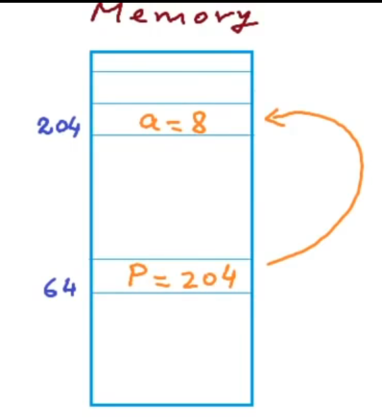
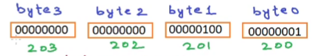
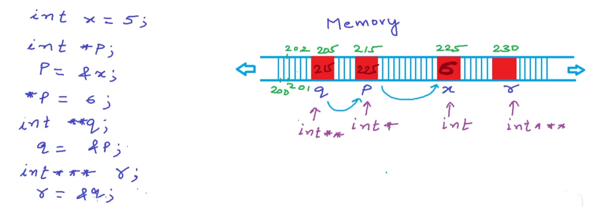
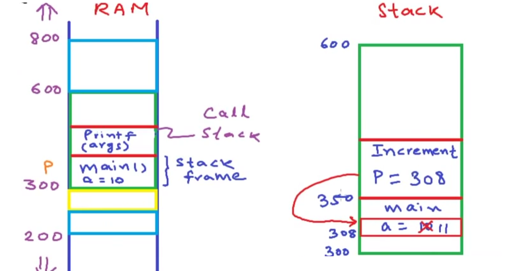
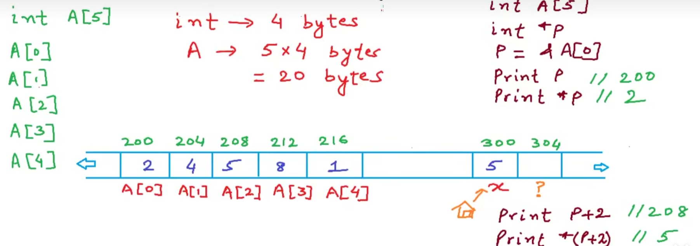
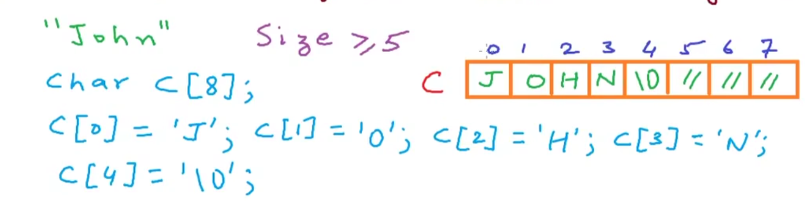
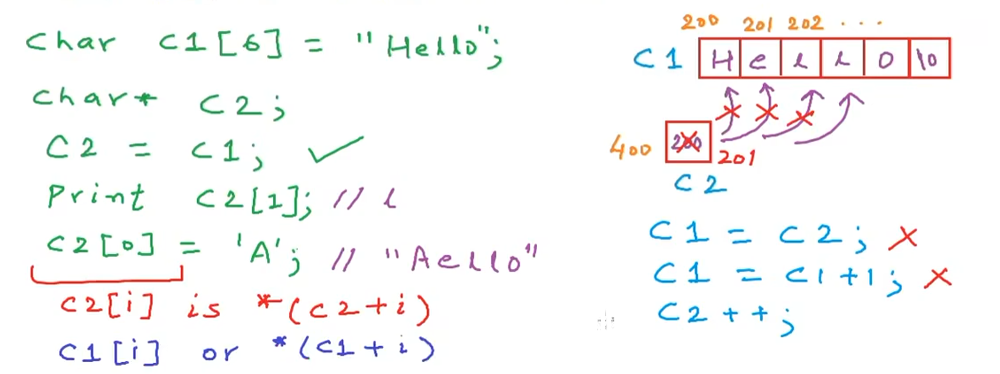
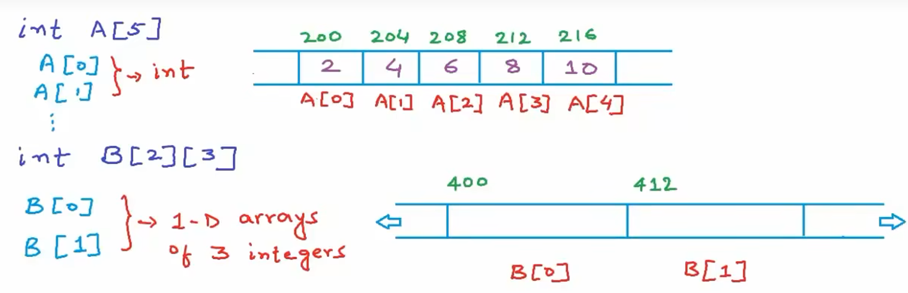
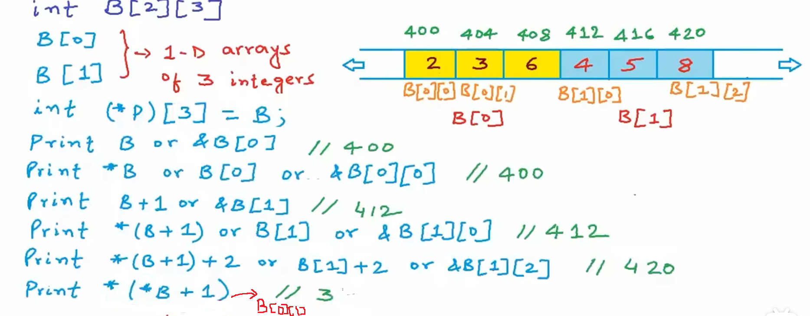

## 指针详解

### 什么是指针

指针是一个变量,它用来存放其他变量的地址。

为了解释更清楚,看一段代码:

```c++
int a;
int *p;
p = &a;
a = 5;
// print为伪代码
print p; // 1; 打印204
print &a; // 2; 打印204
print &p; // 3; 64 
print *p; // 4; 5
*p = 8; // 5; a变为8
```

**p是地址,`*p`是该地址存储的值.**

p和a的关系如下图所示.



解释一下上述代码。语句1;会输出204而`&a`意味取a的地址,所以语句2;也输出204。

可知,**指针变量p其实存储的是绑定变量a的地址。**而语句3;打印64代表指针变量p也有其本身的地址。(同样可以用另一个指针指向地址64指向p)

执行语句5后再打印a的值会发现a变为了5。**当指针p指向a后,改变`*p`将a存储的值。**


### 指针的类型和运算

指针可以为所有变量的类型,也可以为**void**万能类型.

不同类型的指针声明如下

```c++
char *p;
int *p;
double *p;
...
```

下面看一段实际的指针使用场景.

```c++
#include <stdio.h>
int main()
{
  /*
  int a;
  int *p; 
  a = 10;
  p = &a;
  */
  int a = 10;
  int *p = &a; // 1;
  printf("a = %d\n", a);
  printf("%d\n", p);
  printf("%d\n", *p);
  *p = 12;
  printf("a = %d\n", a);
  int b =20;
  *p = b; // 2;
  printf("a = %d\n", a); // 3;
  p = &b; // 4;
  // 指针运算
  printf("%d\n", p); // 假设p为2002
  printf("size of integer is %d bytes\n", sizeof(int));
  printf("%d\n", p+1); // 若p为2002,p+1为2006
}
```

上述代码在DEV-C++5.11中打印为:

```
a = 10
6487572
10
a = 12
a = 20
6487568
size of integer is 4 bytes
6487572
```

`&a`为变量a的地址,语句1;把变量a的地址赋给了指针变量p,此时输出a,p,`*p`分别得到变量a的值,a的地址(p存放的),a的值(p指向的地址的值)。

需要说明语句2;此时p仍然指向a,语句2;是指修改p所指向的地址所存储的值。在后续的语句3;打印变量a的值可以看到a值为20.

而语句4;才是让指针p指向变量b.

上述代码还涉及到了指针的运算:

下面的代码是输出指针p存放的值,即指向变量的地址。假定p指向的变量地址为2002,那么p+1的地址为2006.因为p是int型指针,一个int型变量占4字节大小,p+1即是指向下一个int的位置。

```c++
// 指针运算
printf("%d\n", p); // 假设p为2002
printf("size of integer is %d bytes\n", sizeof(int));
printf("%d\n", p+1); // 若p为2002,p+1为2006
```

下面再来看一段代码

```c
#include <stdio.h>
int main()
{
  int a = 1025;
  int *p;
  p = &a;
  printf("size of integer is %d bytes\n", sizeof(int));
  printf("Address = %d, value = %d\n",p, *p);
  char *p0;
  p0 = (char*)p;
  printf("size of char is %d bytes\n", sizeof(char));
  printf("Address = %d, value = %d\n", p0, *p0);
  
}
```

上述代码输出:

```c
size of integer is 4 bytes
Address = 6487564, value = 1025
size of char is 1 bytes
Address = 6487564, value = 1
  
```

为什么p0的值是1呢？看下图int型变量是4字节` int a = 1025;`语句执行后a实际上的内存位置如下(一般来说内存是从低地址到高地址存储)。而语句`p0 = (char*)p;`实际上是取得200位置的内存也就是byte3即为1。




由此可知,各种类型之间没有本质区别，只是解释内存中的数据方式不同。例如，对于int型指针p，解引用时，会解析4字节，算术运算时，也是以该类型占用空间大小为单位，所以p+1，移动4字节，解引用，处理4字节内容，得到1025。对于char型指针p0，解引用时，会解析1个字节，算术运算时，也是以sizeof(char)为单位，所以p0+1，移动一字节，解引用，处理1字节，得到`00000100`为4。

#### void指针用处

上述代码会遇到一个编译器告警,此时就需要void型指针了上述代码改为

```c
#include <stdio.h>
int main()
{
  int a = 1025;
  int *p;
  p = &a;
  printf("size of integer is %d bytes\n", sizeof(int));
  printf("Address = %d, value = %d\n",p, *p);
  void *p0;
  p0 = p;
  printf("Address = %d\n", p0);
}
```

此时编译器不会告警,void型指针相当于一个泛型指针可以转化为任意类型的指针。

换言之,任何类型指针都可以转为`void*`，它无条件接受各种类型。

### 指向指针的指针



上图左边是伪代码右边是内存位置。

加入有一个变量x值为5它在内存中地址是225。此时`int *p`指向它,p存储的是x的地址所以p的值为225。然后我们通过`*p`赋值修改了x的值为6。此时声明一个`int **`型变量q(指向指针的指针)它指向p.

此时q的值为p的地址225。举一反三,声明一个`int ***`型变量r,r指向q。那么r的值一定为205(q的地址)。

有了图看如下代码:

```c
#include <stdio.h>

int main()
{
  int x = 5;
  int* p = &x;
  *p = 6;
  int** q = &p;
  int*** r = &q;
  printf("%d\n", *p);
  printf("%d\n", *q);
  printf("%d\n", **q);
  printf("%d\n", **r);
  printf("%d\n", ***r);
  ***r = 10; // 等价于**q = 10;
  printf("x = %d\n", x);
}
```

上述代码打印

```
6
6487572
6
6487572
6
x = 10
```

其中`***r = 10;` 和`**q = 10;`是等价的，可以自行尝试。上面的代码就验证了上述的图片。

### 函数传值 vs 传引用

```c
#include <stdio.h>
void Increment(int a)
{
  a = a + 1;
}

void IncrementP(int *a)
{
  *a = (*a) + 1;
}
int main()
{
  int a;
  a = 10;
  Increment(a);
  printf("a = %d\n", a);
  IncrementP(&a);
  printf("a = %d\n", a);
}
```
上述代码输出:

```
a = 10
a = 11
```

Increment函数没有修改main的局部变量a,而IncrementP函数成功将变量a加1。

下图左边是Increment函数,右边是IncrementP



由函数调用栈可知,Increment函数中的a其实是局部变量a和main函数中的局部变量a有不同的内存。修改函数中的局部变量不会对main中的产生影响

而IncrementP函数中的局部变量`*a`获取到了main函数局部变量a的地址然后改变了其对应的值。

结论:使用指针作为函数参数时就是在传引用,传引用可以节省内存并且修改指向内容的值。


### 指针和数组

#### 指针和一位数组

下面的例子以int数组为例子,注:int是4字节(bytes)

如果有一个数组`int A[5]`,那么它总大小为20字节。其内存布局可能如下图:



关注图片右侧的伪代码可以发现指针与数组的,其中要注意指针`p`,此语句`p = &A[0]`和`p = A`是等价的。以数组A为例,在数组中`&A`是整个数组的地址,**A是首元素地址**。

那么打印p实际上输出的是数组首地址为200,注意直接`print A`是与`print p`等价的。打印`*p`实际上是打印200地址存储的值。那么输出p+2是多少呢?要明白一点对于指向数组的指针来说`+1`是指指向下一个位置,因此打印`p+2`输出的地址为208(因为int的大小是4字节,首地址的下两个位置即为208,这里还需要说明打印`A+2`输出也是208,`A+2`即为首元素下两个的位置)。打印`*(p+2)`则为该地址的值5,同时`*(A+2)`输出值也为5。

从这里应该明白了数组和指针是息息相关的,其数组名就是首地址(首个变量取地址)。而**指针加1或者说数组名加1(首地址加1)其实即为指向数组的下一个位置。**这就是指针的精髓。

下面看一个例子。
```c
#include <stdio.h>
int main()
{
  int a[] = {2, 4, 5, 8 ,1};
  printf("%d\n", a);
  printf("%d\n", &a[0]);
  printf("%d\n", a[0]);
  printf("%d\n", *a);
  printf("%d\n", a+2);
  printf("%d\n", *(a+2));
}
```
上述代码输出为:

```c
882258368
882258368
2
2
882258376
5
```
这里要关注第5行和第一行的值,`a`和`a+2`的地址相差8。很明确的说明了`a+2`其实是首地址的下两个位置(偏移8)。


#### 数组作为函数参数

下面看一个例子,要实现一个计算数组中元素和的函数。
```c
#include <stdio.h>
int SumOfElements(int A[], int size)
{
  int i, sum = 0;
  for (i = 0; i < size; i++)
    sum += A[i]; // 等价于*(A+i)
  return sum;
}

int main()
{
  int A[] = {1, 2, 3, 4, 5};
  int total_bytes = sizeof(A);        // 获取数组总字节数
  int size = sizeof(A)/sizeof(int); // 获取数组元素个数
  int total = SumOfElements(A, size);
  printf("Sum of elements = %d\n", total);
}
```

上面的参数`int A[]`和`int *A`是等价的。**当数组名即数组首地址作为参数传入函数时可以很轻松的访问数组的每一个元素,也可以修改相应的元素。**

下面有一个疑问,下面的代码可行吗？答案是否定的,编译器会自动把`int A[]`转换成`int *A`,因为函数的指向是在栈上每次拷贝整个数组没有意义,函数总是拷贝一个然后没有结束再拷贝下一个。

```c
int SumOfElements(int A[])
{
  int i, sum = 0;
  int size = sizeof(A)/sizeof(A[0]);
  for (i = 0; i < size; i++)
    sum += A[i];
  return sum;
}
```


#### 指针和字符数组

首先要明白c语言是如何存储字符串的。C语言存储字符串要满足以下几个特点

1. 字符串的字符数量+1要小于等于数组的大小。

加入要存储`John`字符串,数组的布局就如下图所示:



这里注意`John`字符串如果没有填充满则编译器自动填充,且字符串必须要以NULL作为结尾。因为C语言规定字符串以NULL(ascii码为0)为结束的。

下面来看代码。

```c
#include <stdio.h>
#include <string.h>
int main()
{
  char c[10] = "John";
  char *p = c; // 相当于两个语句 char *p; p = c;
  printf("Size in bytes = %d\n", sizeof(c));
  int len = strlen(c);
  printf("Length  = %d\n", len);
  printf("p is %s, size of pointer = %d\n", p, sizeof(p));
}
```
上面的代码输出,这里要说明指针的大小64位为8字节,32为4字节。
```
Size in bytes = 10
Length  = 4
p is John, size of pointer = 8
```

2. 数组和指针相似但是不是同一个类型

下图就可以解释。



声明了一个字符串数组c1,用指针c2指向它。打印c2[0]是e,同时可以利用c2[0]将字符串c1变为Aello。其中c2[i]等价于`*(c2+i)`而c1[i]等价于`*(c1+i)`。它们的不同主要在于：
`
1. c1字符串数组不能等于c2
2. c1不能进行`c1 = c1 + 1;`的操作。
3. c2可以进行加操作比如`c2++;`即如图所示是指向下一个位置。因此可以通过指向字符串的指针来遍历整个字符串。
`

3. 数组作为函数参数时其实会退化成指针,实际上传的是数组的基地址。

下面看一段代码:

```c
#include <stdio.h>
void print(char *c)
{
  int i = 0;
  while (*(c+i) != '\0')
  {
    printf("%c", *(c+i)); // 等价于c[i]
    i++;
  }
  printf("\n");
}
int main()
{
  char c[20] = "Hello";
  print(c);
}
```
上述代码print函数的逻辑是遍历字符串直到遇到NULL字符(直到字符串末尾),依次打印字符串。上述代码输出为`Hello`

#### 指针和二维数组




一维数组的内存布局是上半部分图,而下半部分则是二维数组的布局。

可以看到二维数组在内存中依然是一维的,其中B[0]的int型变量连续存储在400起始位置地址的内存中，因为int占4字节所以B[0]总共占12字节,因此B[1]的起始地址为412而其结束地址也很容易计算为424。

其中要注意`int *p = B;`会有编译错误,因为B返回的是一个指向一维数组的指针而不是一个整型的指针。

指针的类型是在解引用的或者对它指针运算的时候是非常重要的。

定义一个指向一维数组的指针p(其中的一维数组包含3个整型数),例如`int (*p)[3] = B;`是可行的。**p是指向一维数组的指针**。

要明确一点二维数组是一维数组的数组,因此

1. 数组名代表整个数组所占内存空间的首地址,二维数组名依然如此
2. 二维数组相当于一个一位数组里面的变量是一个一维数组,那么二维数组名指向二维数组的首地址相当于其是**指针的指**,故进行一次解引用得到的还是地址。

看下图。


观察每个print伪代码,明确int占4字节,那么上图的二维数组跳到下一个维度是12字节(3个int型变量)

1. `B`等价于`&B[0]`,`print B`输出为400这很好理解B是该二维数组首地址.
2. `*B`等价于`B[0]`和`&B[0][0]`,`print *B`依然输出的是400但这里的`*B`指向的是二维数组的第一个变量B[0]而B[0]是一个一维数组的名，而该一维数组名为该数组首地址(同时一维数组时候讲了首地址即为首个元素取地址所以`*B`也等价于`&B[0][0]`)。
3. `B+1`等价于`&B[1]`,这里加1是二维数组跳到下一个维度的数组在上图的例子中是偏移12字节,即`B[1]`这个一维数组的首地址。`print B+1`为412
4. `*(B+1)`等价于`B[1]`和`&B[1][0]`,`*(B+1)`相当于取到二维数组的第二个变量B[1]其依然是一个一维数组的名那么该值为数组首地址因此`print *(B+1)`为412。
5. `*(B+1)+2`等价于`B[1]+2`和`&B[1][2]`,`print *(B+1) + 2`输出的是420,即`B[1][2]`的地址,`*(B+1)`指向了二维数组的第二个变量`B[1]`然后+2指向了这个变量的第二个元素即`B[1][2]`。那么如何取到其值呢?很简单`*(*(B+1)+2)`即可输出的值是8
6. `*(*B+1)`等价于`B[0][1]`,`print *(*B+1)`输出为3。很简单可以理解取`*B`取到二维数组的第一个元素的值即该一个一维数组的名称(首地址)加1表示取该一位数组的第1个元素的地址(数组是从0开始计算的)然后再次用`*`来解引用就得到了该地址的值即为3.

那么其实对于二维数组来说:

```c
B[i][j] = *(B[i] + j)
        = *(*(B + i) + j)
```

下面是相应的代码。

```c
#include <stdio.h>
  
int main()
{
  int B[2][3];
  B[0][0] = 2;
  B[0][1] = 3;
  B[0][2] = 6;
  B[1][0] = 4;
  B[1][1] = 5;
  B[1][2] = 8;

  int (*p)[3] = B;
  printf("%d\n", *p[0]);
  printf("B value is %ld\n", B);
  printf("*B value is %ld\n", *B);
  printf("B+1 value is %ld\n", B+1);
  printf("*(B+1) value is %ld\n", *(B+1));
  printf("*(B+1) + 2 value is %ld\n", *(B+1) + 2);
  printf("*(*(B+1)+2) value is %ld\n", *(*(B+1)+2));
  printf("*(*B+1) value is %ld\n", *(*B+1));
  return 0;
}
```

上述代码输出为:
```
2
B value is 140725423286576
*B value is 140725423286576
B+1 value is 140725423286588
*(B+1) value is 140725423286588
*(B+1) + 2 value is 140725423286596
*(*(B+1)+2) value is 8
*(*B+1) value is 3
```

#### 指针和多维数组

c的类型是一个指向2x2的二维数组的指针,对它进行一次解引用会得到一个指向一维数组的指针。数组名c返回一个指向二维数组的指针。c本身是一个数组,这两个类型是不同的。

下面的语句都是等价的:
```
c[i][j][k] = *(c[i][j] + k) = *(*(c[i] + j) + k)
           = *(*(*(c + i) + j) + k)
```

直接看下图,观察伪代码的print打印的值(写在注释位置)就能明白多维数组的内存布局以及怎么获取到值和相应的地址了。


下面看第一个示例代码:

```c
#include <stdio.h>

int main()
{
  int c[3][2][2] = {{{2, 5}, {7, 9}},
          {{3, 4}, {6, 1}},
        {{0, 8}, {11, 13}}};
  printf("%ld %ld %ld %ld\n", c, *c, c[0], &c[0][0]);
  printf("%d\n", *(c[0][0] + 1));
  return 0;
}
```

上面的代码输出为:
```
140729863878032 140729863878032 140729863878032 140729863878032
5
```
可以很明确的知道`c, *c, c[0], &c[0][0]`是等价的,而取值的方式和上文的公式是一样的。

下面看一个通过多维数组作为参数传递给函数的例子。

```c
#include <stdio.h>

int Func(int *a)
{

}
int Func2d(int (*a)[3])
{

}
int Func3d(int *(a)[2][2])
{

}

int main()
{
  int a[2] = {1, 2};
  int b[2][3] = {{2,4,6}, {5,6,7}};
  int c[3][2][2] = {{{2, 5}, {7, 9}},
                    {{3, 4}, {6, 1}},
                    {{0, 8}, {11, 13}}};
  Func(a);
  Func2d(b);
  Func3d(c);
  return 0;
}
```

上面的代码可以运行的，注意上面函数的参数后缀和数组的保持一致就可以了。


### 指针和动态内存

动态分配的内存都是在heap(堆)区

分配内存的函数如下:
1. malloc
该函数作用是分配内存函数原型如下
```c
void* malloc(size_t size)
```
函数参数是内存块的字节数,这个数据类型是size_t这里是为了保证正数。
返回值是一个void型指针,指向了分配内存块的第一个字节的地址。

2. calloc
该函数作用依然是分配内存函数原型如下:
```c
void* calloc(size_t num, size_t size)
```


```c
int *m = (int *)malloc(3 * sizeof(int));
// 上面语句几乎等价于下面的语句,唯一的区别是分配完内存后calloc会初始化而malloc不会。
int *p = (int *)calloc(3, sizeof(int));
```
参数num是特定类型元素的数量,第二个参数size是类型的大小
返回值是一个void型指针,指向了分配内存块的第一个字节的地址。


3. realloc
如果已经有一块动态分配的内存了想修改内存块的大小就是用realloc,函数原型如下:
```c
void* realloc(void *ptr, size_t size)
```
第一个参数指向已分配内存的起始地址的指针。它也可以指定为NULL此时是重新分配新的内存
第二个参数是新的内存块的大小。

与之相应的释放内存的函数如下:
free
函数原型如下:
```c
void free(void * memblock)
```

其中参数为待释放的内存起始地址。


**内存泄露**是指程序中己动态分配的堆内存由于某种原因程序未释放或无法释放，造成系统内存的浪费，导致程序运行速度减慢甚至系统崩溃等严重后果。要注重一个原则谁申请谁释放就可以避免这个问题。

与此同时还需要掌握一些内存检测工具比如valgrind和AddressSanitizer(ASan)等,同时可以使用malloc和free的hook通过LD_PERLOAD来统计每一个内存分配点。

### 函数返回指针

这个操作非常危险,因为函数里面返回值往往是局部变量当出函数后就会被销毁导致返回的指针为空指针。

下面看两个例子:
```c
#include <stdio.h>
int *add(int* a, int* b)
{
  int c = (*a) + (*b);
  return &c;
}

int main()
{
  int a = 2, b = 4;
  int* ptr = add(&a, &b);
  printf("Sum = %d\n", *ptr);
}
```

上述代码运行会报错`Segmentation fault (core dumped)`原因就如上所说。c是函数add内部的局部变量当add函数调用结束后该局部变量销毁c指向的是null而&c是空地址。

那么怎么改上述代码呢?通过动态分配内存。

```c
#include <stdio.h>
#include <stdlib.h>
int *add(int* a, int* b)
{
  int *c = (int*)malloc(sizeof(int));
  *c = (*a) + (*b);
  return c;
}

int main()
{
  int a = 2, b = 4;
  int* ptr = add(&a, &b);
  printf("Sum = %d\n", *ptr);
  free(ptr);
}
```

上面的c不再是函数内部栈上的变量,而是动态分配由我指定什么时候销毁在堆上的变量。因此代码无误上述代码输出为:`Sum = 6`


### 函数指针

用指针来存储函数的地址就被称为函数指针,其实函数调用基本上是一条跳转指令跳转到函数的入口(函数的第一条指令)。注**函数的地址都存储在text段**


函数指针的声明是这样的: 类型 `(*p)(参数...)`。 其中`(*p)`中的p是任意名字指向函数即可,后一个括号是函数的参数要与原函数保持一致。

```c
#include <stdio.h>
int add(int a, int b)
{
  return a + b;
}

void PrintHello()
{
  printf("Hello\n");
}

int main()
{
  int c;
  int (*p)(int, int) = &add; // 这条语句把add的地址赋给p
  c = (*p)(2, 3);
  printf("%d\n", c);
  int (*p2)(int, int) = add;
  c = p2(2, 7);
  printf("%d\n", c);

  void (*hello)() = PrintHello;
  hello();
}
```

上述代码输出:
```
5
9
Hello
```

一般来说`int (*p2)(int, int) = add;`这种声明方式更加容易使用而且更好实现。

### 函数指针的使用(回调函数)

函数指针可以被用来作为函数参数,接收参数为函数指针的函数可以在函数内部调用函数指针指向的另一个函数。


下面是函数指针和回调的示例
```c
#include <stdio.h>
void a()
{
  printf("Hello\n");
}
void b(void (*ptr)())
{
  ptr();
}

int main()
{
  void (*p)() = a;
  b(p);

  // 上面的两个语句可以简化为b(a)
  return 0;
}
```
上述代码输出
```
Hello
```

那么回调函数的实际用途呢？比如我有一个int型数组然后我想要升序排序它们,我可以写一个排序函数来升序排列它们。如果此时又有一个需求要降序排列它们此时再写一个降序逻辑的排序函数会造成大量的代码冗余此时是使用回调函数的好时机。

下面是原始的冒泡排序:
```c
void BubbleSort(int *a, int n)
{
  int i,j,temp;
  for (i = 0; i < n; i++)
  {
    for (j = 0; j < n - 1; j++)
    {
      if (a[j] < a[j+1]) // 比较a[j]和a[j+1]有需要则互换位置
      {
        temp = a[j];
        a[j] = a[j+1];
        a[j+1] = temp;
      }
    }
  }
}
```

下面是有回调函数的冒泡排序,回调函数有两个参数其基本逻辑是比较两个整型,当第一个参数大于第二个参数时返回1,当两个参数相等时返回0,当第一个参数小于第二个参数时返回-1。

```c
#include <stdio.h>
void BubbleSort(int *a, int n, int (*compare)(int,int))
{
  int i,j,temp;
  for (i = 0; i < n; i++)
  {
    for (j = 0; j < n - 1; j++)
    {
      if (compare(a[j], a[j+1]) > 0) // 比较a[j]和a[j+1]有需要则互换位置
      {
        temp = a[j];
        a[j] = a[j+1];
        a[j+1] = temp;
      }
    }
  }
}
// 升序,a大于b捕交换位置,说明保证前一个比后一个大则为升序。
int compare(int a, int b)
{
  if (a > b) return -1;
  else return 1;
}
// 降序,很好理解a大于b返回-1即为交换,保证前一个一定小于后一个是为降序。
int compare2(int a, int b)
{
  if (a > b) return 1;
  else return -1;
}

int main()
{
  int i, a[] = {3,2,1,5,6,4};
  BubbleSort(a, 6, compare);
  for (i = 0; i < 6; i++)
  {
    printf("%d ", a[i]);
    printf("\n");
  }
  printf("-------------\n");
  BubbleSort(a, 6, compare2);
  for (i = 0; i < 6; i++)
  {
    printf("%d ", a[i]);
    printf("\n");
  }
}
```

上述代码输出为,可以看到完全符合逻辑:

```
6 
5 
4 
3 
2 
1 
-------------
1 
2 
3 
4 
5 
6 
```