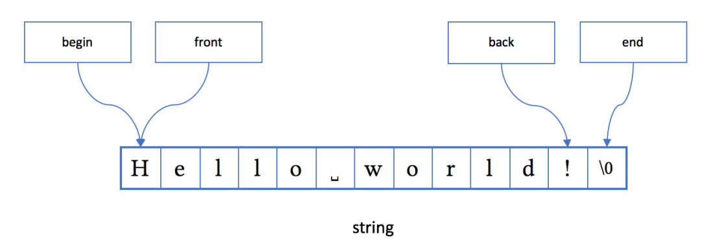
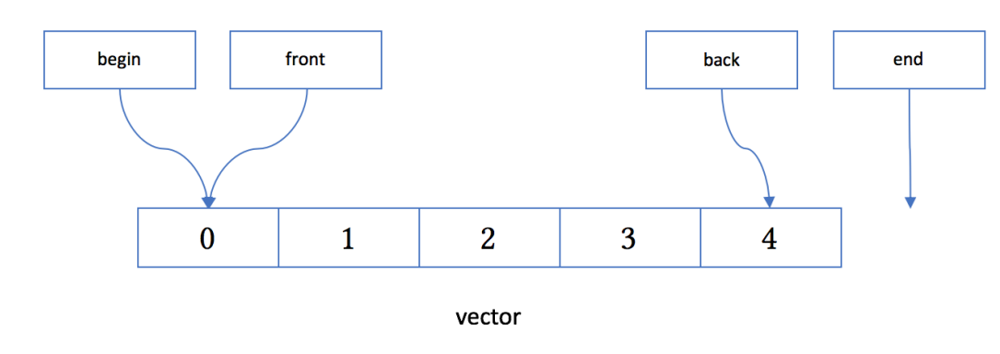
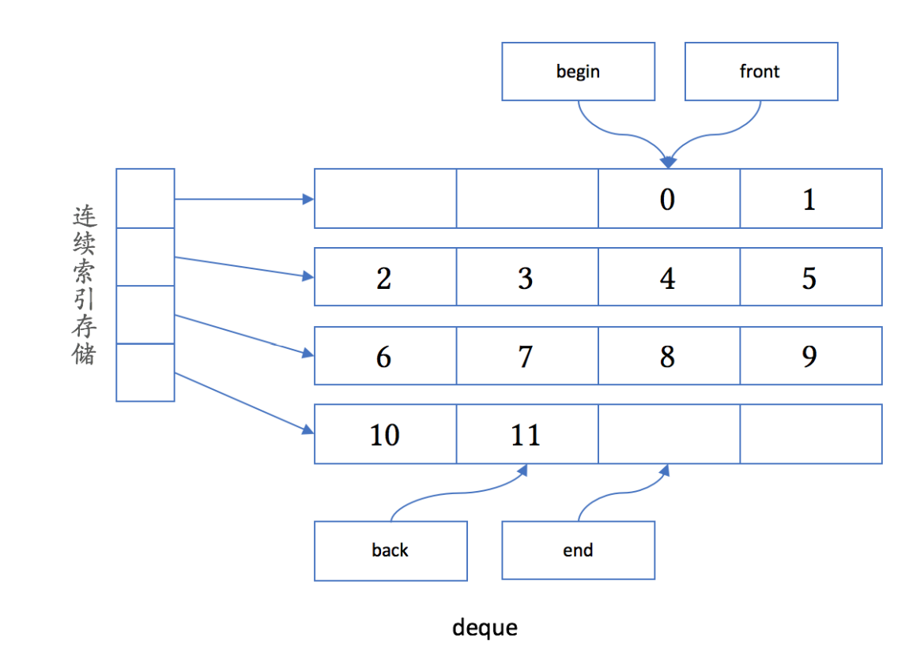

### 容器

下面代码需要先下载如下网址的single header文件
https://github.com/adah1972/output_container

output_container.h的使用范例如下:

```c++
#include <iostream>
#include <map>
#include <vector>
#include "output_container.h"

using namespace std;

int main()
{
	map<int, int> mp{
		{1, 1}, {2, 4}, {3, 9};
	}
	cout << mp << endl;
	vector<vector<int> vv{
		{1, 1}, {2, 4}, {3 ,9}
	};
	cout << vv << endl;
}
```

上述代码输出如下:
```
{ 1 => 1, 2 => 4, 3 => 9 }
{ { 1, 1 }, { 2, 4 }, { 3, 9 } }
```

#### string

`string`是模板`basic_string`对于`char` 类型的特化，可以认为是一个只存放字符 
`char`类型数据的容器。“真正”的容器类与 `string `的最大不同点是里面可以存放任意类
型的对象。

跟其他大部分容器一样， string具有下列成员函数：


- `begin` 可以得到对象起始点
- `end` 可以得到对象的结束点
- `empty` 可以得到容器是否为空
- `swap` 可以和另外一个容器交换其内容

编码语言的习惯区间都为左闭右开,c++也如此。即C++的 begin和end是半开半闭区间：在容器非
空时，begin指向一个第一个元素，而end 指向最后一个元素后面的位置；在容器为空
时，begin等于end。在string的情况下，由于考虑到和C 字符串的兼容，end指向代
表字符串结尾的`\0`字符

上面就几乎是所有容器的共同点了。也就是说：

- 容器都有开始和结束点
- 容器会记录其状态是否非空
- 容器有大小
- 容器支持交换
当然，这只是容器的“共同点”而已。每个容器都有其特殊的用途。
string的内存布局大致如下图所示：



不管是内存布局，还是成员函数，string 和 vector 是非常相似的。

string支持如下函数:

1. 字符拼接(+,+=)
2. 字符串的查找(find和rfind)
3. 支持istream读入字符串(getline)
4. 支持通过`const char*`接口传递字符串内存(c_str)
5. 支持数字互转(stoi和to_string)

如果不修改字符串,使用`const string&`或C++ 17的`string_view`作为类型参数最佳。推荐使用`string_view`它在只有C字符串的情况下,也不会引发不必要的内存复制。

下面看一个简单的例子:

```c++
string name;
cout << "What's your name? ";
getline(cin, name);
cout << "Nice to meet you, " << name
 << "!\n";

// 上述代码输出
/*
What's your name? hlt   (注这个hlt是我输入的)
Nice to meet you, hlt!
*/

```

#### vector

动态数组

基本相当于Java的ArrayList和Python的list。
和 string 相似，vector的成员在内存里连续存放，同时begin、end、front、back
成员函数指向的位置也和string 一样，大致如下图所示：



- `data` 来获得指向其内容的裸指针（同 string）
- `capacity` 来获得当前分配的存储空间的大小，以元素数量计（同 string）
- `reserve` 来改变所需的存储空间的大小，成功后capacity()会改变（同
string）
- `resize` 来改变其大小，成功后size()会改变（同 string）
- `pop_back` 来删除最后一个元素（同 string）
- `push_back` 在尾部插入一个元素（同 string）
- `insert` 在指定位置前插入一个元素（同 string）
- `erase` 在指定位置删除一个元素（同 string）
- `emplace` 在指定位置构造一个元素
- `emplace_back` 在尾部新构造一个元素

留意push_…和pop_… 成员函数。它们存在时，说明容器对指定位置的删除
和插入性能较高。vector 适合在尾部操作，这是它的内存布局决定的。只有在尾部插入和
删除时，其他元素才会不需要移动，除非内存空间不足导致需要重新分配内存空间。

当 push_back、insert、reserve、resize 等函数导致内存重分配时，或当
insert、erase 导致元素位置移动时，vector 会试图把元素“移动”到新的内存区域

注:
vector通常保证强异常安全性，如果元素类型没有提供一个保证不抛异常的移动构造函
数，vector通常会使用拷贝构造函数。对于拷贝代价较高的自定义元素类型，
应当定义移动构造函数，并标其为noexcept，或只在容器中放置对象的智能指针。

准则:如果对象要放入到vector中尽量要给对象实现移动构造函数(move constractor)并且要用noexcept修饰该函数。

右值引用的具体阐述请看:
[C++的优化以及右值引用的价值](doc/senior/s1.md)

下面代码 [源文件](https://github.com/helintongh/CplusplusQuickGuide/blob/master/src/07STL%E5%BA%93%E7%9A%84%E5%BA%95%E5%B1%82%E5%8E%9F%E7%90%86%E4%BB%A5%E5%8F%8A%E4%BD%BF%E7%94%A8/09vector_with_class.cpp)

```c++
#include <iostream>
#include <vector>

using namespace std;

class Obj1
{
public:
	Obj1()
	{
		cout << "Obj1()\n";
	}
	Obj1(const Obj1&)
	{
		cout << "Obj1(const Obj1&)\n";
	}
	Obj1(Obj1 &&)
	{
		cout << "Obj1(Obj1&&)\n";
	}
};
class Obj2
{
public:
	Obj2()
	{
		cout << "Obj2()\n";
	}
	Obj2(const Obj2&)
	{
		cout << "Obj2(const Obj2&)\n";
	}
	Obj2(Obj2 &&) noexcept
	{
		cout << "Obj2(Obj2&&)\n";
	}
};

int main()
{
	vector<Obj1> v1;
	v1.reserve(2);
	v1.emplace_back();
	v1.emplace_back();
	v1.emplace_back();
	vector<Obj2> v2;
	v2.reserve(2);
	v2.emplace_back();
	v2.emplace_back();
	v2.emplace_back();
}
/*
Obj1()
Obj1()
Obj1()
Obj1(const Obj1&)
Obj1(const Obj1&)
Obj2()
Obj2()
Obj2()
Obj2(Obj2&&)
Obj2(Obj2&&)
*/
```

Obj1和Obj2的定义只差了一个`noexcept`，但这个小小的差异就导致了`vector`是否会移动对象。这点非常重要。
C++11开始提供的`emplace…` 系列函数是为了提升容器的性能而设计的。把
`v1.emplace_back()` 改成 `v1.push_back(Obj1())`。对于`vector`里的内容，结果是
一样的；但使用`push_back`会额外生成临时对象，多一次拷贝构造和一次析构。
现代处理器的体系架构使得对连续内存访问的速度比不连续的内存要快得多。因而，`vector`的连续内存使用是它的一大优势所在。
`vector`的一个主要缺陷是大小增长时导致的元素移动。如果可能，尽早使用 `reserve` 函数为 `vector` 保留所需的内存，这在 `vector`预期会增长到很大时能带来很大的性能提升。


#### deque

双端队列

容器不仅可以从尾部自由地添加和删除元素，也可以从头部自由地添加和删除。

deque 提供 push_front、emplace_front 和 pop_front 成员函数。

内存布局如下:



1. 如果只从头、尾两个位置对`deque`进行增删操作的话，容器里的对象永远不需要移动。
2. 容器里的元素只是部分连续的（因而没法提供`data`成员函数）。
3. 由于元素的存储大部分仍然连续，它的遍历性能是比较高的。
4. 由于每一段存储大小相等，deque支持使用下标访问容器元素，大致相当于index[i
/ chunk_size][i % chunk_size]，因此访问deque中的元素依然很高效。


