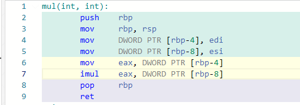
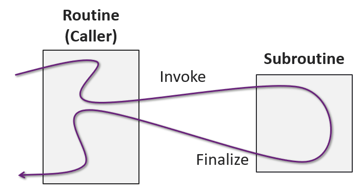
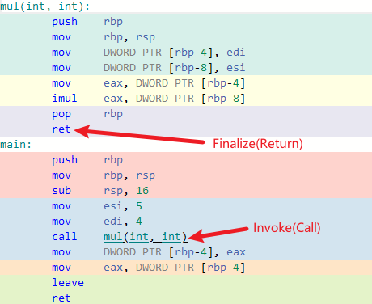
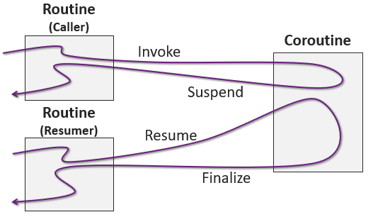
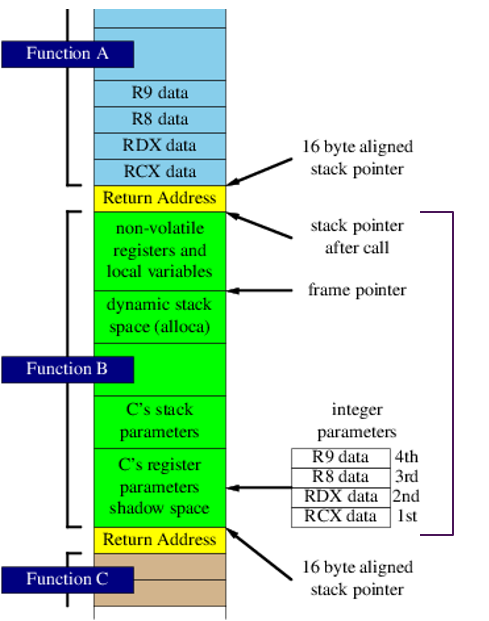
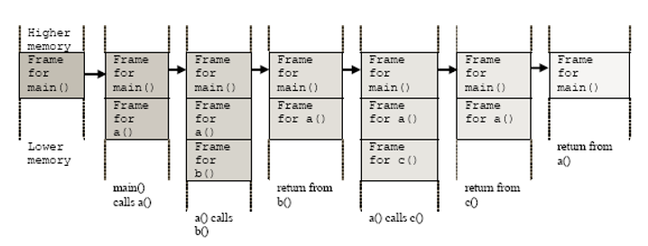
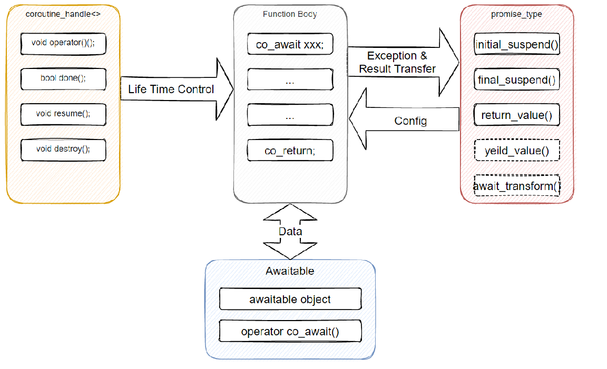
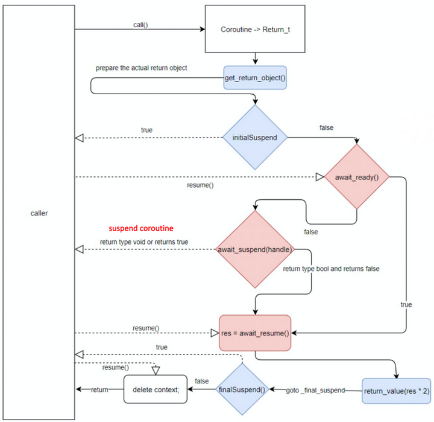
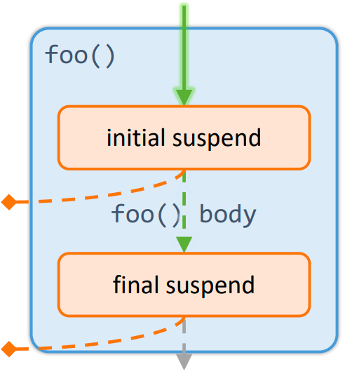

## C++20协程

首先要明确一点C++官方协程是无栈协程并且实现比较原始,所以现在协程主要是给写库的人使用的。

怎么用协程写一个实际运用,我推荐一个我重度参与的基于c++ 20协程的http client库 [cinatra](https://github.com/qicosmos/cinatra/blob/master/include/cinatra/coro_http_client.hpp) 可以作为参考。

C++的协程api总共有三大组件:

- Operators & Awaitable Type 操作与等待类型
- Promise 代表了一个异步操作的结果
- Coroutine Handle 协程处理

## 理解协程

要理解协程首先要理解普通程序的调用栈。

```cpp
int mul(int a, int b) {
    return a * b;
}

int main() {
    int c = mul(4, 5);
}
```

其中实现的`mul`函数对应的汇编如下图:



由图可以知道普通程序是:

一组有序的指令,而最关键的是汇编指令`imul`,前面的指令都是把字节从源位置传到目的位置。而`imul`指令是机器行为的抽象,并且实现了机器状态之间的转换。

为了解释更清楚一点,函数在整个程序的生命周期重总共有四种状态:

- Invocation(调用)
  
    跳转(转到jump to)到函数起始地址

- Activation(激活)

    跳进(jump into)函数的某个位置(可能是起始地址可能是函数别的地址)

- Suspension(暂停)

    在函数执行完成前跳转到另一个协程中。

- Finalization(完成)

    清理掉函数调用栈(函数执行完成)

普通的程序(后面统一叫例程,例程包含多线程或多进程程序)就只支持两种操作:: Invoke/Finalize

调用如下图:



普通的函数调用后直接到完成然后就结束了。

看上面的`mul`函数代码的汇编指令,其中Invake阶段就是汇编中`call`指令可以清楚看到调用的就是`mul`函数,然后当`mul`函数到了`ret`指令时其就已经执行完成(Finalize)了。




理解协程还需要懂得两个基本概念(简单来说):

**Process进程**: 在OS上运行程序的方式(一组有序的指令执行)

**thread线程**: 进程中的控制流的抽象(处理器抽象(CPU))

## 协程支持的四种操作:

协程是一种特殊的子例程,尽管理论上来讲两者毫无关联,但是实际机器中协程是例程的超集。

协程可以通过yield(“让步”)来调用其它协程,接下来的每次协程被调用时,从协程上次yield返回的位置接着执行,通过yield方式转移执行权的协程之间不是调用者与被调用者的关系,而是彼此对称、平等的。由于协程不如子例程那样被普遍所知,下面对它们作简要比较： 


| 操作     | 例程        | 协程      | 说明                       |
| -------- | ----------- | --------- | -------------------------- |
| Invoke   | supported   | supported | 转到程序(函数)的开始(call) |
| Finalize | supported   | supported | 清理堆栈并返回             |
| Suspend  | unsupported | supported | yield当前控制流程(函数)    |
| Resume   | unsupported | supported | 在程序暂停点恢复           |

下面就是这四种操作



## 协程状态

例程也是有状态的,普通例程的状态等同于其内存。普通例程怎么记录时那个函数被执行的呢。

如下图



绿色部分便是保存例程状态的内存对象,其保存是是Function B的状态(函数执行栈即是其状态)。

一个程序实际调用栈是这样的:

如下图



可以看到普通例程是怎么管理函数调用栈(函数栈帧)的:

invoke(调用): 函数起始地址(栈帧)入栈
return(返回,等价于Finalize): 函数的栈帧(出入参等)出栈

C语言所有函数都是这种调用.

以上协程定义很明确了如下:

- 保持其自身的状态(函数栈帧Function Frame)
- 支持除invoke和return外还支持Suspend以及Resume两种操作

## C++中的协程核心

只要用到了这三个`co_await`,`co_yeild`,`co_return`关键字中的一个就会被当作协程。

**C++ 20协程概览图**



**协程和普通例程的api调用区别**


| 操作     | 例程                    | 协程                    |
| -------- | ----------------------- | ----------------------- |
| Invoke   | Function call, e.g. f() | Function call, e.g. f() |
| Finalize | return statement        | co_return statement     |
| Suspend  |                         | co_await expression     |
| Resume   |                         | co_yeild expression     |

由上述可知C++协程有四个核心对象: Function Body(实际待执行的语句), coroutine_handle<>,  promise_type<>, Awaitable对象

## 协程相关的对象

### 协程帧(coroutine frame)

当caller调用一个协程的时候会先创建一个协程帧，协程帧会创建promise对象，再通过promise对象产生return object

协程帧中主要有这些内容:

- 协程参数
- 局部变量
- promise对象

这些内容在协程恢复运行的时候会用到，caller通过协程帧的句柄`std::coroutine_handle`来访问协程帧。

### promise_type

promise_type 是 promise 对象的类型。promise_type 用于定义一类协程的行为，包括协程创建方式、协程初始化完成和结束时的行为、发生异常时的行为、如何生成 awaiter 的行为以及 co_return 的行为等等。promise 对象可以用于记录/存储一个协程实例的状态。每个协程桢与每个 promise 对象以及每个协程实例是一一对应的。

### coroutine return object

它是由promise.get_return_object()方法创建的,一种常见的实现手法是会将`coroutine_handle`存储到`coroutine object`内，使得该`return object`获得访问协程的能力。

### coroutine_handle<>

协程的句柄。

主要用于协程的生命周期控制，协程执行的入口，判断协程是否完成，恢复一个挂起的协程，删除一个协程。

换言之其作用在于访问底层的协程帧、恢复和释放协程帧。

可以通过调用`std::coroutine_handle::resume()`唤醒协程。

### co_await、awaiter、awaitable

- co_await: 一元操作符定义挂起点
- awaitable: 支持co_await操作符的类型
- awaiter: 定义了await_ready、await_suspend 和 await_resume 方法的类型(实现awaiter必须定义这三个函数)

补充:
- co_return: 定义协程的结束点
- co_yield: 定义协程的恢复点

### c++协程工作原理

以一个简单的伪代码形式展示协程是如何协作的:

```c++
Return_t foo() {
    auto res = co_await awaiter;
    co_return res;
}
```

Return_t: promise return object
awaiter: 等待一个task完成(是一个对象)



上图即是协程执行流程图.

浅蓝色部分的方法是Return_t关联的promise对象的函数，浅红色部分是co_await等待的awaiter。

**总结**:

协程待执行需要执行的任务中的promise_type对象需要实现至少五个方法:

1. get_return_object(): 用于协程对象返回
2. initial_suspend(): 控制当前协程是否挂起
3. final_suspend(): 当协程内语句执行完成时，控制协程是否挂起
4. return_void(): 保存协程的返回值
5. unhandled_exception(): 处理异常

awaiter对象对象需要实现至少三个方法:

1. await_ready(): 控制是否挂起协程还是继续执行
2. await_suspend(): 决定是返回caller还是继续执行
3. await_resume(): 决定是否恢复caller

上图的这个流程的执行是由编译器根据协程函数生成的代码驱动的，分成三个部分

**协程创建**

上面的代码语义就只有如下两句:

`co_await awaiter`等待task完成

`co_return res`获取协程返回值和释放协程帧

协程的创建:

```cpp
Return_t foo() {
    auto res = co_await awaiter;
    co_return res;
}
```

foo()协程会生成下面这样的模板代码(伪代码),C++所有协程的创建都会产生类似的代码:

```cpp
{
  co_await promise.initial_suspend();
  try
  {
    coroutine body;
  }
  catch (...)
  {
    promise.unhandled_exception();
  }
FinalSuspend:
  co_await promise.final_suspend();
}
```

首先需要创建协程，创建协程之后是否挂起则由调用者设置`initial_suspend`的返回类型来确定。

创建协程的流程如下:

- 创建一个协程帧(coroutine frame)
- 在协程帧里构建promise对象
- 把协程的参数拷贝到协程帧里
- 调用promise.get_return_object()返回给caller一个对象,即代码中的Return_t对象

我们可以通过 `promise` 的 `initial_suspend` 和 `final_suspend` 返回类型来控制协程是否挂起，在 `unhandled_exception` 里处理异常，在 `return_value` 里保存协程返回值。可以根据需要定制 `initial_suspend` 和 `final_suspend` 的返回对象来决定是否需要挂起协程。如果挂起协程，代码的控制权就会返回到caller，否则继续执行协程函数体(function body)。



这里要说明

```cpp
#include <concepts>
#include <coroutine>
#include <exception>
#include <iostream>

struct ReturnObject {
    struct promise_type {

    }
}
```