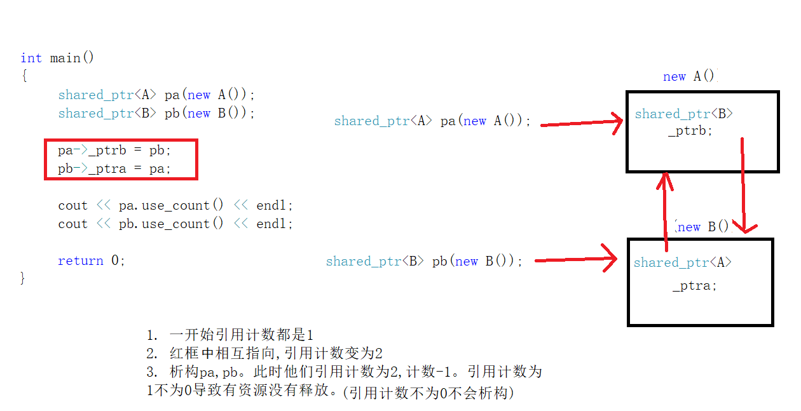

## 智能指针

智能指针要搞清楚下面几个模块:
1. 不带引用计数的智能指针:auto_ptr,scoped_ptr,unique_ptr
2. 带引用计数的智能指针shared_ptr,weak_ptr
3. make_shared和make_unique
4. 智能指针的交叉引用(循环引用)问题
5. 多线程访问共享对象问题
6. 自定义删除器

直接看代码
```c++
#include <iostream>
using namespace std;
// 1.裸指针--内存要手动管理的指针,需要申请和释放的指针
/* 
   2.智能指针 保证能做到资源的自动释放
 		利用栈上的对象出作用域自动析构特性,来做到资源的自动释放
 	CSmartPtr<int> *p = new CSmartPtr<int>(new int);  => 智能指针能否定义在堆上?
 		此时是裸指针,需要delete p。所以智能指针不能定义在堆上
 */
template<typename T>
class CSmartPtr // 非常简单的智能指针
{
public:
	CSmartPtr(T *ptr = nullptr)
		:mptr(ptr) {}
	~CSmartPtr() { delete mptr; }
	T& operator*() { return *mptr; } // 返回引用,要改变mptr的值。重载*运算符
	T* operator->() { return mptr; } // 重载->运算符
private:
	T *mptr;
};
```
上面指针的使用:
```c++
int main()
{
	// 1.裸指针--内存要手动管理的指针,需要申请和释放的指针
	int *p = new int(10);
	*p = 30;
	delete p;
	// int *p = new int;
	CSmartPtr<int> ptr1(new int); // return后依次析构,就防止了内存泄露
	*ptr1 = 20; // 改变指针内存存放的值‘
	class Test
	{
	public:
		void test() { cout << "call Test::test" << endl;}
	}
	CSmartPtr<Test> ptr2(new Test());
	// (ptr2.operator->())->test(); => 智能指针对象调用->重载返回的结果再调用test()函数
	// 意味着->重载函数和*重载函数都是不带参数的,就是返回智能指针底层管理资源的指针,再通过该指针调用当前方法
	ptr2->test(); // (*ptr2).test();

	return 0;
}
```

说到底智能指针就是利用了C++的出作用域会调用对象的析构函数这一特性的一种对象。智能指针还需要注意不能`CSmartPtr<int> *p = new CSmartPtr<int>(new int);`定义在堆上。因为没法在析构时`delete p`(无法析构时操作堆上的资源)。


## 不带引用计数的智能指针

先看源代码:

```c++
#include <iostream>
#include <memory>
using namespace std;
int main()
{
	// std::move => c++11 右值引用 std::move得到当前遍历的右值类型
	unique_ptr<int> p1(new int);
	unique_ptr<int> p2(std::move(p1));

	// *p1一定会失败,因为p1的资源已经移动给p2。是显示的资源转移

	/*
	1. 之前的CSmartPtr存在的问题
	CSmartPtr<int> p1(new int);
	CSmartPtr<int> p2(p1); 
	// p1 p2 => new int => 用户认为操作的始终是同一块资源
	*p1 = 20;
	*p2 = 30;
	*/
	auto_ptr<int> ptr1(new int); //永远让最后一个智能指针掌握资源,之前的置为nullptr。会转移资源所有权到最新的指针,之前的置为空
	auto_ptr<int> ptr2(ptr1);

	*ptr2 = 20;
	//cout << *ptr1 << endl; // 程序崩溃
	// 所以被废弃且不推荐使用auto_ptr， vector<auto_ptr<int>> vec1; vec2(vec1); -> 不要在容器中使用auto_ptr
	return 0;
}
```

auto_ptr为什么会被废弃,它有一个隐式操作。就是只会让最后一个智能指针掌握资源,之前的置为nullptr。这会导致很多问题。
来看一下

auto_ptr
那么不带引用计数的智能指针推荐使用boost库的scoped_ptr和C++11官方自带的unique_ptr。
让我们来看unique_ptr的调用:
可以发现unique_ptr必须要一个move显示转移才能让p2掌握p1的资源。
```c++
unique_ptr<int> p1(new int);
unique_ptr<int> p2(std::move(p1));
```
那么unique_ptr和scoped_ptr究竟和auto_ptr有什么不同呢？
scoped_ptr--针对auto_ptr做的改进

* scoped_ptr(const scoped_ptr<T>&) = delete;
* scoped_ptr<T>& operator=(const scoped_ptr<T>&) = delete;
* scoped_ptr的拷贝构造和赋值构造函数直接被删除了

unique_ptr
*	unique_ptr(const unique_ptr<T>&) = delete;
*	unique_ptr<T>& operator=(const unique_ptr<T>&) = delete;	
*	unique_ptr也删除了拷贝构造和赋值构造函数,但是提供了move版本的拷贝构造和赋值构造函数
*	`unique_ptr<unique_ptr<T> &&src)`
*	`unique_ptr<T>& operator=(unique_ptr<T>&& src)`

所以unique_ptr很简单就知道了底层就是只提供move构造函数和move拷贝构造函数的auto_ptr。

## 带引用计数的智能指针

```c++
#include <iostream>
#include <memory>
using namespace std;
// 对资源进行引用计数的智能指针
template<typename T>
class RefCnt
{
public:
	RefCnt(T *ptr = nullptr)
		:mptr(ptr)
	{
		if(mptr != nullptr)
			mcount = 1;
	}
	void addRef() { mcount++; } // 增加引用计数
	int delRef() { return --mcount; }
private:
	T *mptr;
	int mcount; // automic_int 在shared_ptr和weak_ptr中是原子类型
};


template<typename T>
class CSmartPtr // 非常简单的智能指针 相比于shared_ptr多线程环境下就不行了,没有锁,shared_ptr和weak_ptr是线程安全的
{
public:
	CSmartPtr(T *ptr = nullptr)
		:mptr(ptr) 
	{
		mpRefCnt = new RefCnt<T>();
	}
	~CSmartPtr() 
	{ 
		if(0 == mpRefCnt->delRef())
		{
			delete mptr; 
			mptr = nullptr;
		}
	}
	T& operator*() { return *mptr; } // 返回引用,要改变mptr的值。重载*运算符
	T* operator->() { return mptr; } // 重载->运算符

	CSmartPtr(const CSmartPtr<T> &src)
		:mptr(src.mptr),mpRefCnt(src.mpRefCnt) // 拷贝资源时,先把指针给我,再把引用计数给我
	{
		if(mptr != nullptr)
			mpRefCnt->addRef(); // 引用计数+1
	}
	CSmartPtr<T>& operator=(const CSmartPtr<T> &src)
	{
		if(this == &src)
			return *this; // 防止自赋值

		if(0 == mpRefCnt->delRef())// 减少一个引用计数并判断
		{
			delete mptr;
		}

		mptr = src.mptr;
		mpRefCnt = src.mpRefCnt;
		mpRefCnt->addRef();
		return *this;
	}
private:
	T *mptr;	// 指向资源的指针
	RefCnt<T> *mpRefCnt; // 指向该资源引用计数对象的指针
};

int main()
{
	/*
	带引用计数的智能指针shared_ptr和weak_ptr
	带引用计数:多个智能指针可以管理同一资源
	带引用计数:给每一个对象资源,匹配一个引用计数
	智能指针 => 引用这个资源的时候 => 引用计数+1
	智能指针 => 不使用该资源的时候 => 引用计数-1 => !=0不析构, ==0资源释放
	*/
	CSmartPtr<int> ptr1(new int);
	CSmartPtr<int> ptr2(ptr1);
	CSmartPtr<int> ptr3;
	ptr3 = ptr2;

	*ptr1 = 20;
	cout << *ptr2 << " " << *ptr3 << endl;

	return 0;
}
```

上面代码实现了一个带引用计数的智能指针,很简单。带引用计数实质上是拷贝资源的时候,先把指针给我,再把引用计数给我(引用计数+1)。析构时不仅释放资源,还引用计数-1。

拿这时候有人就问了为什么需要shared_ptr和weak_ptr呢这两种引用计数智能指针呢?

他们是为了解决一个问题。交叉引用。

## make_shared和make_unique

make_shared是C++11的一部分,而make_unique是C++14的内容。不过想在c++11使用make_unique也很容易

```c++
template<typename T, typename... Ts>
std::unique_ptr<T> make_unique<Ts&&... params>
{
	return std::unique_ptr<T>(new T(std::forward<Ts>(params)...));
}
```
上面的make_unique只是利用`forward`完美转发了它的参数到它要创建的对象的构造函数中去，由new
出来的原生指针构造一个std::unique_ptr,并且将之返回。该构造不支持数组以及自定义的deleter功能。

下面是声明一个智能指针用make和不用make的差别。
```c++
auto upw1(std::make_unique<Widget>());//使用make函数
std::unique_ptr<Widget> upw2(new Widget);//不使用make函数
auto spw1(std::make_shared<Widget>());//使用make函数
std::shared_ptr<Widget> spw2(new Widget);//不使用make函数
```

### make智能指针的使用

1. make_shared

make_shared使用如下:
```c++
#include <iostream>
#include <memory>

int main () {

  std::shared_ptr<int> foo = std::make_shared<int> (10);
  // same as:
  std::shared_ptr<int> foo2 (new int(10));
  auto bar = std::make_shared<int> (20);
  auto baz = std::make_shared<std::pair<int,int>> (30,40);
  std::cout << "*foo: " << *foo << '\n';
  std::cout << "*bar: " << *bar << '\n';
  std::cout << "*baz: " << baz->first << ' ' << baz->second << '\n';

  return 0;
}
// 输出为
/*
*foo: 10
*bar: 20
*baz: 30 40
*/
```

2. make_unique

make_unique使用如下:
```c++
#include <iostream>
#include <iomanip>
#include <memory>
 
struct Vec3
{
    int x, y, z;
 
    // following constructor is no longer needed since C++20
    Vec3(int x = 0, int y = 0, int z = 0) noexcept : x(x), y(y), z(z) { }
 
    friend std::ostream& operator<<(std::ostream& os, const Vec3& v) {
        return os << "{ x=" << v.x << ", y=" << v.y << ", z=" << v.z << " }";
    }
};
 
int main()
{
    // Use the default constructor.
    std::unique_ptr<Vec3> v1 = std::make_unique<Vec3>();
    // Use the constructor that matches these arguments
    std::unique_ptr<Vec3> v2 = std::make_unique<Vec3>(0,1,2);
    // Create a unique_ptr to an array of 5 elements
    std::unique_ptr<Vec3[]> v3 = std::make_unique<Vec3[]>(5);
 
    std::cout << "make_unique<Vec3>():      " << *v1 << '\n'
              << "make_unique<Vec3>(0,1,2): " << *v2 << '\n'
              << "make_unique<Vec3[]>(5):   ";
    for (int i = 0; i < 5; i++) {
        std::cout << std::setw(i ? 30 : 0) << v3[i] << '\n';
    }
}
/*
* 程序输出如下:
	make_unique<Vec3>():      { x=0, y=0, z=0 }
	make_unique<Vec3>(0,1,2): { x=0, y=1, z=2 }
	make_unique<Vec3[]>(5):   { x=0, y=0, z=0 }
    	                      { x=0, y=0, z=0 }
        	                  { x=0, y=0, z=0 }
            	              { x=0, y=0, z=0 }
                	          { x=0, y=0, z=0 }
*/
```


这里可以看出make的优势:
1. 使用new需要重复写一遍type，而使用make函数不需要。重复敲type违背了软件工程中的一项基本原则：代码重复应当避免。
2. 为了保证产生异常后程序的安全也应该使用make。
3. std::make_shared （和直接使用new相比）的显著特性就是提升了效率

make的劣势:
1. 不支持指定自定义的deleter(无法自定义智能指针删除器)
2. 传递大括号initializer的需要
3. 对于std::shared_ptr来说，使用make函数的额外的不使用场景还包含(1)带有自定义内存管理的class(2)内存非常紧俏的系统，非常大的对象以及比对应的std::shared_ptr活的还要长的std::weak_ptr

优势3说明
```c++
/* 代码只需一次内存分配，但实际上它执行了两次。
 * 每一个std::shared_ptr都指向了一个包含被指向对象的引用计数的控制块，
 * 控制块的分配工作在std::shared_ptr的构造函数内部完成。
 * 直接使用new，就需要一次为Widget分配内存，
 * 第二次需要为控制块分配内存。
*/
std::shared_ptr<Widget> spw(new Widget);
auto spw = std::make_shared<Widget>();
```

**针对优势2做以下说明**
假如有函数如下:
```c++
void processWidget(std::shared_ptr<Widget> spw,int priority);
```
按值传递`std::shared_ptr`可能存在问题，但是如果processWidget总是要
创建一个`std::shared_ptr`的拷贝(例如，存储在一个数据结构中，来跟踪已经被处理过的
Widget)，这也是一个合理的设计.

现在假设有一个函数来计算相关的优先级
```c++
int computePriority()
// 如果调用processWidget时，使用new而不是 std::make_shared :
processWidget(std::shared_ptr<Widget>(new Widget),computePriority())
```
上述代码可能造成内存泄露。上面的代码调用顺序为:
```
1. 执行"new Widget".
2. 执行computePriority.
3. 执行std::shared_ptr的构造函数
```

如果这样的代码在runtime被产生出来,computePriority产生出了一个异常，那么在Step 1中动
态分配的Widget可能会产生泄漏.因为它永远不会存储在Step 3中产生的本应负责管理它
的 std::shared_ptr 中。

## 智能指针的交叉引用和解决

交叉引用问题如下图:

图中说的很清楚了。交叉引用导致有部分引用计数永不为0就永不会释放。

于是有了强弱之分的智能指针。

shared_ptr: 强智能指针 可以改变资源的引用计数
weak_ptr: 弱智能指针 不会改变资源的引用计数.观察者,不能调用资源。没有提供operator* 和 operator->
		watch	       watch
weak_ptr ==> shared_ptr ==> 资源(内存)

看如下代码。
```c++
#include <iostream>
#include <memory>

using namespace std;
class B;
class A
{
public:
	A() { cout << "A()" << endl; }
	~A(){ cout << "~A()" << endl; }
	//shared_ptr<B> _ptrb; // 指向B类型的智能指针 => 这里改成弱智能指针就可避免循环引用的问题
	void testA() { cout << "pretty good method!!" << endl; }
	weak_ptr<B> _ptrb;
};

class B
{
public:
	B() { cout << "B()" << endl; }
	~B(){ cout << "~B()" << endl; }	
	void func()
	{
		//_ptra->testA();		// 执行失败是弱智能指针,没法直接使用指向的资源
		shared_ptr<A> ps = _ptra.lock(); // 提升weak_ptr为强智能指针
		if(ps != nullptr)
		{
			ps->testA();
		}
	}
	weak_ptr<A> _ptra; // 指向A类型的智能指针
};

int main()
{
	shared_ptr<A> pa(new A());
	shared_ptr<B> pb(new B());

	pa->_ptrb = pb;
	pb->_ptra = pa;

	cout << pa.use_count() << endl; // 打印引用计数
	cout << pb.use_count() << endl; 
	
	pb->func();

	return 0;
}
```
优先关注:

```c++
void func()
{
	//_ptra->testA();		// 执行失败是弱智能指针,没法直接使用指向的资源
	shared_ptr<A> ps = _ptra.lock(); // 提升weak_ptr为强智能指针
	if(ps != nullptr)
	{
		ps->testA();
	}
}
```
只有当执行函数时才提权为强智能指针。

## 多线程安全问题

智能指针还可以避免多线程安全的问题。

直接看代码:

```c++
  
#include <iostream>
#include <memory>
#include <thread>
using namespace std;

/*
C++著名网络库Muduo
多线程访问共享对象的线程安全问题
*/
class A
{
public:
	A() { cout << "A()" << endl; }
	~A(){ cout << "~A()" << endl; }
	void testA() { cout << "pretty good method!!" << endl; }
};
// 子线程
//void handler_one(A *q) // 裸指针会造成线程不安全
void handler_one(weak_ptr<A> pw)
{
	std::this_thread::sleep_for(std::chrono::seconds(2)); // 休眠两秒,如果是裸指针此时访问的对象很可能析构了
	// q访问A对象的时候,需要侦测A对象是否存活 -> shared_ptr,weak_ptr监测
	shared_ptr<A> sp = pw.lock();
	if(sp != nullptr)
	{
		sp->testA();
	}
	else
	{
		cout << "A对象已经析构,不能再访问!" << endl;
	}
}
// main线程
int main()
{
	//A *p = new A();
	{
		shared_ptr<A> p(new A());
		thread t1(handler_one, weak_ptr<A>(p));
		t1.detach(); // 线程分离
		
		std::this_thread::sleep_for(std::chrono::seconds(2));
	}
	
	std::this_thread::sleep_for(std::chrono::seconds(20)); // 主线程需要等待才能看到效果,不然对象早就析构了
	//delete p;
	// 阻塞等待线程结束,出作用域才析构,不把t1放到作用域里一直等
	//t1.join(); 
	
	
	return 0;
}
```

## 智能指针删除器

有时候释放资源需要指定释放的方式。

```c++

#include <iostream>
#include <memory>
#include <functional>
using namespace std;
/*
智能指针删除器
智能指针:能够保证资源绝对的释放 delete ptr;
*/
// unique_ptr shared_ptr
/*
~unique_ptr() { ...(是一个函数调用); deletor(ptr); } 
template<typename T>
class default_delete
{
public:
	void operator() (T *ptr)
	{
		delete ptr;
	}
}
*/
template<typename T>
class MyDeletor
{
public:
	void operator() (T *ptr) const
	{
		cout << "call MyDeletor operator()!!" << endl;
		delete []ptr;
	}
};
template<typename T>
class MyFileDeletor
{
public:
	void operator() (T *ptr) const
	{
		cout << "call MyFileDeletor operator()!!" << endl;
		fclose(ptr);
	}
};

int main()
{
	// 自定义释放资源的方法
	unique_ptr<int, MyDeletor<int>> ptr1(new int[100]); // delete []ptr;
	unique_ptr<FILE, MyFileDeletor<FILE>> ptr2(fopen("data.txt", "w"));
	/*
		每个释放方式写一个资源释放函数会造成大量代码冗余。
			有没有办法直接写在unique_ptr中,指定释放资源的函数
		lambda表达式 => 函数对象 function
	*/
	// function 指定函数对象返回类型为void,参数为int*
	unique_ptr<int, function<void(int*)>> ptr3 (new int[100],
		[](int *p)->void {
			cout << "call lambda release new int[100]" << endl;
			delete []p;
		}
	);
	unique_ptr<FILE, function<void(FILE*)>>ptr4 (fopen("data.txt","w"),
		[](FILE *p)->void {
			cout << "call lambda release fopen" << endl;
			delete []p;
		}
	);
	
	return 0;
}
```

上面的代码我推荐lambda表达式的方式,因为这些函数调用次数不多,lambda正好适合这种情况。